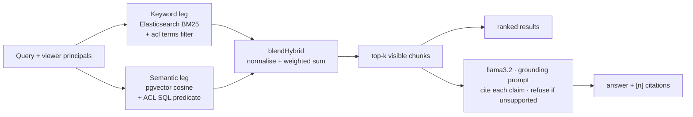

# IndexFlow

Permission-aware hybrid workspace search with grounded, cited answers — and an evaluation harness
that measures whether any of it actually works.


## What it is

Upload documents, search them, and get answers that cite their sources — where **every result is
filtered by who you are**. A document is visible to you only if it is public, yours, or shared
with you or a group you belong to, and that rule is enforced independently on *both* retrieval
legs rather than applied as a filter after the fact.

The part worth looking at is the measurement. Retrieval quality, answer groundedness, permission
leakage, and latency at scale each have a runnable eval with a pass/fail gate, and the retrieval
gate runs in CI on every pull request. All LLMs run locally through Ollama — no API keys.


## How it works

A query fans out to two independent retrieval legs and the results are blended:



**Retrieval.** Documents are chunked semantically, embedded locally with
`Xenova/all-MiniLM-L6-v2` (384-dim, ONNX in-process), and written to two stores: Postgres with a
pgvector HNSW index for the semantic leg, and Elasticsearch for BM25. `lib/hybrid.ts` normalises
each leg's scores and combines them at a keyword weight of 0.40, chosen by the sweep in the eval.

**Permissions** (`lib/acl.ts`). A viewer resolves to a set of principals — `public`, `user:<id>`,
`group:<id>`. Each document carries the matching ACL token set, denormalised onto its
Elasticsearch chunks and derivable in SQL. A document is visible when the two sets intersect. The
keyword leg enforces this with a `terms` filter, the semantic leg with a SQL predicate, so neither
leg can return something the other would have hidden. Generation only ever sees chunks that
survived that filter, so a restricted document cannot leak through an answer.

**Ingestion** is asynchronous: upload stores the original to MinIO and enqueues a BullMQ job; a
worker extracts text (`.md`/`.txt`/`.pdf`), chunks, embeds, and writes both stores.

**Answers** are generated by a local `llama3.2:3b` under a grounding prompt that requires `[n]`
citations and refusal when the retrieved context does not support an answer.

### Run it locally

Needs Node 22+, pnpm 9+, and Docker. Ollama is optional — answers and the generation eval only.

```bash
pnpm install
pnpm db:up                                   # Postgres, Redis, Elasticsearch, MinIO
pnpm db:migrate
cp apps/web/.env.example apps/web/.env       # set AUTH_SECRET; Google OAuth for sign-in
pnpm dev                                     # http://localhost:3000
pnpm worker                                  # required for uploads to index
pnpm seed                                    # optional demo corpus (needs SEED_TOKEN)
```

**Public demo mode.** Setting `DEMO_MODE=1` makes a deployment safe to expose: `/signin` offers
"Continue as guest" so no Google account is needed, uploads, deletes and sharing all refuse with
403, and `/api/answer` returns real permission-filtered citations with an explanation instead of
generating (a host has no local Ollama). Both switches are off unless explicitly set. Search and
the live `/eval` page work normally for guests. See `.env.example`.

## Results

> **Every number below comes from [`apps/web/eval/RESULTS.md`](apps/web/eval/RESULTS.md)** — the
> captured output of a single dated run (2026-07-26), with the exact command for each. That file
> is the only source of truth for measurements in this repo. **Do not edit numbers here by hand;
> re-run the evals and update that file.**

| What | Command | Result |
|---|---|---|
| Retrieval quality | `pnpm --filter @indexflow/web eval` | hybrid **MRR 0.96**, R@1 90%, R@5 97% — vs semantic 0.94, keyword 0.89 |
| Answer groundedness | `pnpm --filter @indexflow/web eval:rag` | faithfulness **98%**, relevance 100%, citations 100%, refusal **92%** |
| Permission leaks | `pnpm --filter @indexflow/web acl:leak` | **9/9** pass, no leaks across either leg |
| Sharing lifecycle | `pnpm --filter @indexflow/web acl:sharing` | **8/8** pass |
| Direct object access | `pnpm --filter @indexflow/web acl:dao` | **13/13** pass — by-id fetch/delete/upload and job listings are gated |
| Adversarial | `pnpm --filter @indexflow/web eval:adversarial` | **0/30** unauthorised disclosures, **0/10** prompt-injection leaks |
| Latency at scale | `pnpm --filter @indexflow/web bench:latency` | p50 flat 1k→100k chunks: semantic 2.4–2.9 ms, hybrid 8.6–10.2 ms |

Measured over 34 queries across 17 documents (retrieval) and 20 answerable + 12 unanswerable
questions (generation), on an 8 GB Mac with everything in local Docker.

**Hybrid earns its place.** Keyword alone wins exact-match queries, semantic alone wins
paraphrases, and the blend beats both (MRR 0.96 vs 0.94 and 0.89) because it keeps 97% R@1 on
exact-match queries without giving up paraphrase recall.

**Reranking is off, because it made things worse.** A `bge-reranker-base` cross-encoder pass over
the blended top-10 scores **MRR 0.89 against plain hybrid's 0.96** — it demotes the correct
document on 4 of the 34 queries. It stays in the eval as a measured negative result rather than
being quietly deleted; the four regressions are listed in `RESULTS.md`.

## Limitations

Read the results as evidence the system works on a small labelled fixture set, not as production
performance.

- **Small fixtures, tuned on themselves.** 34 retrieval queries over 17 documents; 32 generation
  questions. There is no held-out test split — the hybrid weight was tuned by a sweep on the same
  queries the metrics are reported on, so 0.96 is mildly optimistic. Differences of a few points
  are noise. Separating tuning and test sets is the next planned change.
- **Three 100% scores mean "no failures at this size"**, not "solved". The generation eval's two
  actual failures are printed in `RESULTS.md` rather than averaged away.
- **The latency benchmark uses synthetic vectors** and a fixed vocabulary. It measures latency,
  not quality, at scale. Its "index throughput" is bulk-load speed, not real ingestion.
- **The generator is a 3B model** over 6 contexts. A larger model would score differently.
- **Gate floors are calibrated just under the first real run**, so passing means "has not
  regressed", not "meets an external bar".
- **Not production-hardened.** Single-node everything, and no cross-store transactional
  consistency — an Elasticsearch write failure during ingestion can leave a document marked
  indexed with no keyword-leg presence. Tracked in `improvements.txt`.
- **Rate limiting is in-memory**, so limits are per process and reset on restart. It stops
  accidental hammering and casual abuse of the expensive evaluation endpoints, not a distributed
  attacker; real protection belongs at the edge. The one-at-a-time concurrency cap on the eval
  endpoints is the part that actually protects the host.
- **One known telemetry bug:** the adversarial eval reports `Average input tokens: 0`, which is a
  defect in the harness, not a measurement.

## Layout

```
apps/web/
  app/          Next.js routes — UI + /api/{search,answer,documents,eval}
  lib/          retrieve · hybrid · embed · es · acl · sharing · rag · llm · ingest
  eval/         harnesses + RESULTS.md (canonical numbers)
  bench/        latency & scale benchmark
  worker/       BullMQ ingestion worker
infra/          docker-compose: Postgres+pgvector, Elasticsearch, Redis, MinIO
improvements.txt  phased hardening roadmap (security, reliability, testing, deploy)
```

## License

MIT
