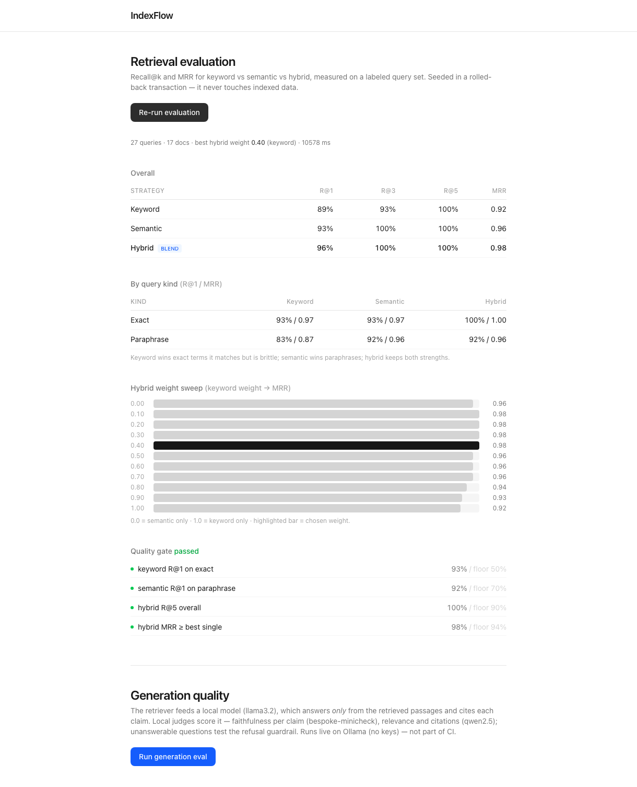
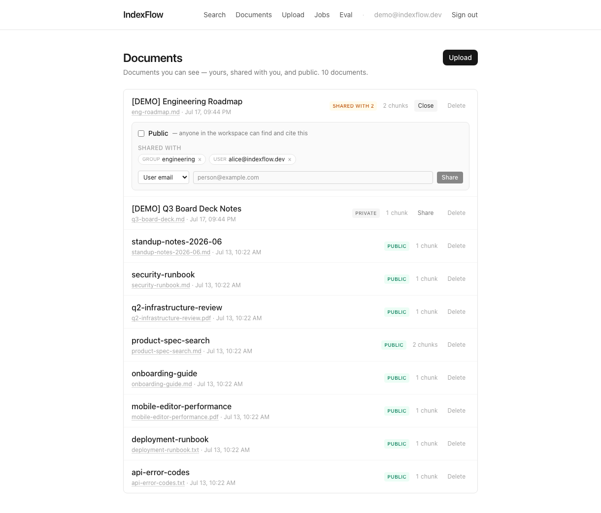
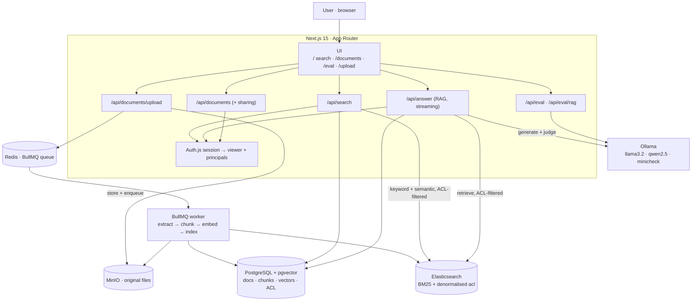
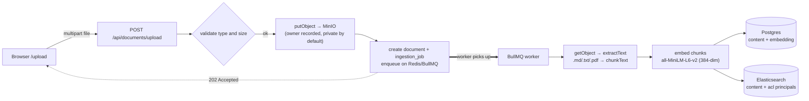
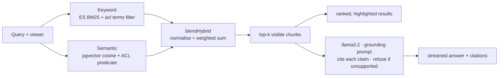
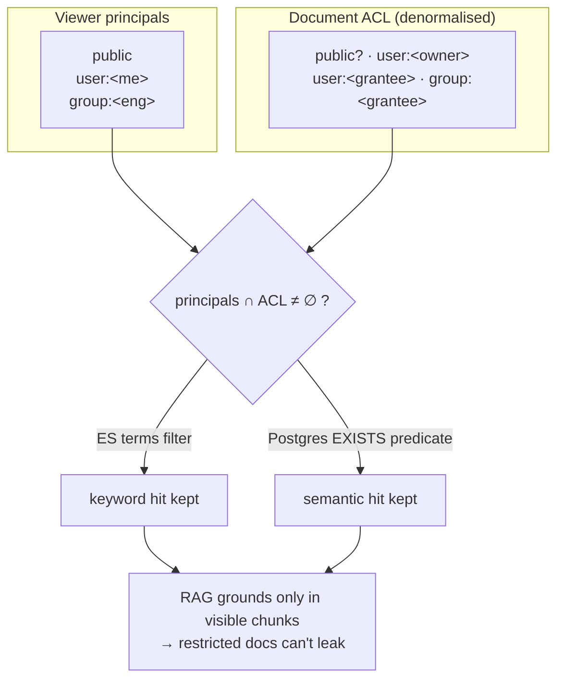
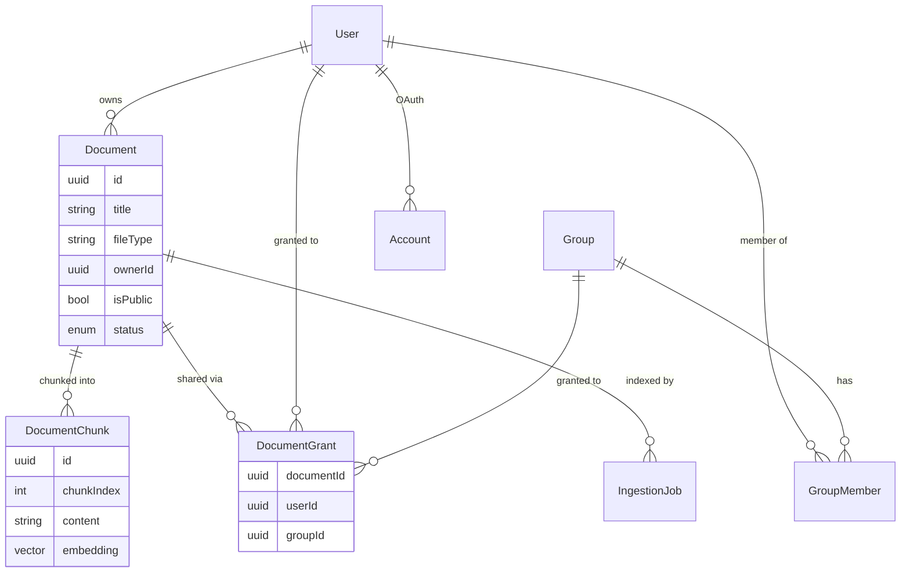

<div align="center">

# IndexFlow

**Permission-aware hybrid workspace search with grounded, measured RAG.**

Upload your documents, search them with keyword + semantic + a measured hybrid blend, and get a
grounded answer with citations — where every result and every citation respects who is allowed to
see what, and every quality claim is backed by a number.

[](https://github.com/JCHETAN26/IndexFlow/actions/workflows/ci.yml)


</div>

---

## What it is

IndexFlow is an end-to-end enterprise-style search engine. It indexes each document two
complementary ways (BM25 keyword + vector semantic), blends them with a weight **chosen by
measurement rather than guessed**, and layers a **grounded RAG** answer on top that cites its
sources and refuses when the corpus can't support an answer. The whole thing is
**permission-aware**: search and RAG only ever retrieve or cite what the asking user is allowed
to see, proven by a leak test. It runs entirely on local infrastructure and **local LLMs (Ollama)** —
no API keys.

The through-line is **"measure it, don't guess it."** Retrieval quality, hallucination rate, and
permission enforcement each have a runnable check that produces a number or a pass/fail gate.

### Highlights

| | |
|---|---|
| 🔎 **Hybrid retrieval** | BM25 (Elasticsearch) + vector (pgvector), blended. **MRR 0.96** across a fixed 34-query benchmark, outperforming vector-only and reranked configurations with **<1s p95 retrieval latency**. |
| 🤖 **Grounded RAG, measured** | Local `llama3.2` answers only from retrieved passages with `[n]` citations. LLM-judged: **98% faithfulness · 92% refusal** on a deliberately-hard 32-question set. |
| 🔒 **Permission-aware** | ACL enforced independently on *both* retrieval legs (ES `terms` filter + Postgres predicate). A restricted doc never leaks into search or an answer — **proven, 0 leaks across 40 adversarial queries**. |
| ⚙️ **Real infrastructure** | Async ingestion on a BullMQ/Redis worker, original files in MinIO, Postgres as source of truth, Auth.js sign-in — not a toy. |
| ✅ **CI quality gate** | The retrieval eval runs on every PR; "green" means retrieval didn't regress. |

---

## Screenshots

**Search + grounded answer** — a hybrid result list with a streamed, cited answer above it
("grounded in 6 sources"), and per-result score / file-type / highlight badges.


**Live evaluation** (`/eval`) — the measurement centerpiece: recall@k and MRR per strategy, a
by-query-kind breakdown, the hybrid weight sweep, and a pass/fail quality gate.



**Permission-scoped documents + sharing** — you see only what you own, was shared with you, or is
public; owned documents get a sharing panel (public toggle, per-user / per-group grants, revoke).



---

## Table of contents

- [Why hybrid search](#why-hybrid-search)
- [Feature tour](#feature-tour)
- [Architecture](#architecture)
- [Tech stack](#tech-stack)
- [The three search modes](#the-three-search-modes)
- [Grounded answers (RAG)](#grounded-answers-rag)
- [Permission-aware search](#permission-aware-search)
- [Measurement & verification](#measurement--verification)
- [Repository layout](#repository-layout)
- [Component deep dive](#component-deep-dive)
- [Data model](#data-model)
- [Quick start](#quick-start)
- [Scripts](#scripts)
- [Environment variables](#environment-variables)
- [Development workflow & CI](#development-workflow--ci)
- [Design decisions (FAQ)](#design-decisions-faq)
- [Current limitations](#current-limitations)
- [Roadmap](#roadmap)

---

## Why hybrid search

Two kinds of search have opposite strengths:

| | Good at | Bad at |
|---|---|---|
| **Keyword** (BM25) | Exact strings: error codes, API names, config keys, IDs | Paraphrases — it matches words, not meaning |
| **Semantic** (vector) | Meaning: "typing feels slow" finds "input latency" | Exact tokens, and it can misrank when a document's embedding is "diluted" |

Keyword search runs on **Elasticsearch** (BM25 with `or` term semantics), which ranks a document by
how many query terms it matches and how rare they are — strong on exact identifiers but blind to
meaning: a query for "typing feels slow" won't match a doc that only says "input latency" (keyword
paraphrase R@1 is just 83%, vs 92% semantic).

**Hybrid** blends both. It keeps keyword's exact-match guarantees and semantic's paraphrase
coverage, and in the evaluation it beats both individual strategies (**MRR 0.98** vs semantic 0.96
vs keyword 0.92). The blend weight is chosen by an offline sweep over a labeled query set — the
project's core habit of measuring instead of guessing.

---

## Feature tour

- **Grounded answers** — ask a question and get a streamed, cited answer above the results,
  generated by a local model that answers *only* from retrieved passages and **refuses** when they
  don't support an answer.
- **Three search modes** — keyword, semantic, hybrid — switchable in the UI, with XSS-safe
  Elasticsearch highlighting and keyboard navigation (↑/↓/Esc).
- **Permission-aware everything** — search, RAG, and the documents list all respect an ACL model
  (public / owner / user grant / group grant); a self-serve **sharing panel** manages access.
- **Upload & async index** — `.md` / `.txt` / `.pdf` (PDF text via unpdf), chunked and embedded
  off-request on a **BullMQ worker**, mirrored into Elasticsearch, with a live `/jobs` status page.
- **Live evaluation page** (`/eval`) — recall@k, MRR, a hybrid weight sweep, and a pass/fail gate,
  plus an on-demand generation (hallucination) eval — run in the browser.
- **Sign-in** — Google OAuth via Auth.js establishes the viewer identity that drives permissions.
- **CI quality gate** — the retrieval eval runs on every PR against real Elasticsearch + pgvector.

---

## Architecture

IndexFlow is a Next.js application (UI + API routes) plus a standalone **BullMQ worker**. Postgres
is the source of truth, the vector store (pgvector), and the ACL store; **Elasticsearch** owns
keyword search, BM25 ranking, highlighting, and a denormalised ACL index; original files live in
**MinIO**; **Redis** backs the ingestion queue; **Ollama** serves the local LLMs. Chunk ids are
generated in app code so one id keys a Postgres row and an ES document — that's how hybrid
correlates keyword + semantic hits.

### System overview



### Ingestion pipeline (async)



### Search & answer (retrieval → RAG)



### Permission model

A document is visible to a viewer when their principals intersect the document's ACL. The **same
rule** is enforced on both retrieval legs, independently.



---

## Tech stack

| Layer | Choice | Why |
|---|---|---|
| Framework | **Next.js 15** (App Router) + **React 19** | One app for UI and API routes; server routes run on Node |
| Language | **TypeScript** (strict) | Typed end to end |
| Styling | **Tailwind CSS v4** | Consistent styling, zero custom CSS framework |
| Database | **PostgreSQL 16** + **pgvector** | Source of truth, vector search, and the ACL store |
| Keyword search | **Elasticsearch 8** | BM25 ranking, highlighting, filters, and the ACL `terms` index |
| Auth | **Auth.js (NextAuth v5)** + Google OAuth | Establishes the viewer identity behind permissions |
| Queue | **Redis 7** + **BullMQ** | Off-request ingestion jobs with retry + backoff |
| Object storage | **MinIO** (S3-compatible) | Stores the original uploaded files |
| ORM | **Prisma 6** | Typed schema + migrations; raw SQL where pgvector needs it |
| Embeddings | **Transformers.js** (`all-MiniLM-L6-v2`, 384-dim) | Real semantic vectors, in-process, **no API key**, runs in CI |
| LLMs (RAG + judges) | **Ollama** (`llama3.2:3b`, `qwen2.5:7b`, `bespoke-minicheck`) | Local generation + LLM-as-judge, **no API key** |
| Tooling | **pnpm** workspace, **tsx** | Workspace scripts; run TS without a build step |
| CI | **GitHub Actions** | Build + evaluation gate on every PR |

---

## The three search modes

Keyword reads from Elasticsearch; semantic reads from `document_chunks` in Postgres. Both stores are
keyed by the same chunk ids, so hybrid can blend them — and both apply the viewer's ACL filter.

**Keyword** — an Elasticsearch `multi_match` over `content` (and a lightly boosted `title`) with
`or` term semantics, ranked by BM25, with an `acl` `terms` filter on the viewer's principals. BM25
is unbounded, so scores are min-max normalized for display.

**Semantic** — the query is embedded with the same MiniLM model, then chunks are ranked by cosine
distance (`embedding <=> queryVector`); score = `1 − distance`, with an SQL visibility predicate.

**Hybrid** — fetch candidates from both, blend with `blendHybrid` (min-max normalize each strategy,
weighted-sum, drop zeros), and return the top results. Snippets prefer the keyword candidate (it
carries the ES highlight fragments) and fall back to escaped content for semantic-only hits.

**XSS-safe highlighting:** Elasticsearch wraps matches in sentinel tokens (`@@HL_START@@` /
`@@HL_END@@`); the server HTML-escapes the whole snippet and only then swaps the sentinels for
`<mark>`. Raw chunk content can never inject markup.

---

## Grounded answers (RAG)

On top of the retriever sits a RAG layer that turns "here are the matching passages" into "here's
the answer, with citations" — and, in keeping with the thesis, its quality is **measured, not
assumed**. It runs entirely on **local models via [Ollama](https://ollama.com)** — same spirit as
the local MiniLM embeddings, so IndexFlow is a fully self-hostable RAG with **no API keys**.

**Answer** (`lib/rag.ts`, `lib/llm.ts`, `app/api/answer`): a query retrieves the top-k hybrid chunks
(already ACL-filtered), which are fed to **`llama3.2:3b`** under a strict grounding prompt — answer
*only* from the passages, cite every claim as `[n]`, and if they don't support an answer, **refuse**
rather than guess. The answer streams token-by-token into the search page with clickable citations.
`lib/llm.ts` is the only provider-specific file; everything else consumes a provider-neutral stream.

**Measured** (`eval/answers.json`, `eval/rag-harness.ts`): a labeled set of answerable + unanswerable
questions runs through the real retriever and generator, then **LLM judges** score each answer —
**faithfulness** per claim via **`bespoke-minicheck`** (a purpose-built grounded-factuality checker),
**answer relevance** and **citation correctness** via **`qwen2.5:7b`**; unanswerable questions test
the **refusal** guardrail. Generator and judges are different models, so there's no self-preference
bias.

**Latest run** — 32 questions (20 answerable + 12 unanswerable), `k=6`:

| Metric (mean over its subset) | Score |
|---|---|
| Faithfulness — answerable | **98%** |
| Answer relevance — answerable | 100% |
| Citation correctness — answerable | 100% |
| Context recall — answerable | 100% |
| Refusal correctness — unanswerable | **92%** |

The set is deliberately built to be breakable: it mixes **multi-hop** questions (the answer lives in
two passages that must be combined) and **adjacent-topic distractors** — questions whose exact
on-topic document *is* retrieved but whose specific fact isn't in the text (e.g. "exactly how many
times is a webhook retried before dead-lettering?" when the source says only "after several failed
attempts"). Those are the classic hallucination trap, and they caught two real failures: a synthesis
mistake on a combined 504-vs-429 question, and the model *naming* a specific CRDT algorithm the
corpus never states instead of refusing. A believable number with a known weakness is a stronger
signal than a suspicious 100% — these are the honest ceiling of a 3B model on a set designed to
expose it.

```bash
# one-time: install Ollama, then
ollama pull llama3.2:3b && ollama pull qwen2.5:7b && ollama pull bespoke-minicheck

pnpm --filter @indexflow/web eval:rag   # gen + LLM-judge, CLI table + gate
# or open /eval → "Run generation eval"
```

It's **on-demand, not in CI** (LLM-judging is slow and loads several GB of models). On an 8 GB box
the harness runs the three models in phases and unloads between them (only one resident at a time);
a full run is ~15–20 min. Swap in bigger local models (or a hosted provider) via `RAG_MODEL` /
`JUDGE_MODEL` / `FAITHFULNESS_MODEL`.

---

## Permission-aware search

Enterprise search is only useful if it respects who is allowed to see what. IndexFlow's hybrid
search **and** its RAG answers are permission-aware: a query only ever retrieves, ranks, or cites
chunks the asking user is allowed to see — and a restricted document cannot leak into a generated
answer, even indirectly.

**The model** (`lib/acl.ts`, `prisma/schema.prisma`). A document is visible to a viewer if it is
**public**, they **own** it, or a **grant** targets them **directly** or via a **group** they belong
to (`Group` / `GroupMember` / `DocumentGrant`). New uploads default to private (owner-only) until
shared. Identity comes from the Auth.js session via `auth()` in the search and answer routes; an
unauthenticated request resolves to a public-only viewer.

**Enforced on both retrieval legs, independently** — this is the part that mirrors how real
enterprise search works:

| Leg | How the ACL is enforced |
|---|---|
| **Keyword (Elasticsearch)** | Each chunk is indexed with a denormalised `acl` list of principal tokens (`public`, `user:<id>`, `group:<id>`). The query adds a `terms` filter on the viewer's principals, so restricted chunks are excluded **at the index**, before ranking. |
| **Semantic (Postgres/pgvector)** | The same rule as a SQL predicate over the ownership + grant tables (`is_public OR owner_id = viewer OR EXISTS grant …`). |

Both legs feed the shared retriever (`lib/retrieve.ts`), whose entry points **require** a `viewer` —
so search and RAG (`lib/rag.ts`) inherit the filter automatically and can't accidentally retrieve
unfiltered.

**Proven, not asserted** (`eval/acl-leak.ts`). The leak test seeds users, a group, and documents
with different ACLs, then drives the **real** retrieval + answer code (not a reimplementation) and
checks that a viewer never retrieves a restricted document on the keyword leg, the semantic leg, or
the blended path — **even when that document is the single most relevant match** — that positive
controls hold (the owner and a granted group member *do* retrieve it), and that a RAG answer for a
restricted query never contains the secret (the generator **refuses**, because the one relevant doc
was filtered out before generation ever ran). 9/9 pass.

**Managing access** (`/documents`, `lib/sharing.ts`). The documents page is itself permission-scoped:
you see only documents you own, that are shared with you, or that are public, and you can only delete
your own. Each owned document has a **sharing panel** — toggle public, grant access to a user (by
email) or a group (by name), and revoke. Every sharing change re-syncs the document's ACL into
Elasticsearch in place (`syncDocumentAcl`), so it takes effect on both retrieval legs immediately.

---

## Measurement & verification

Every capability has a runnable check that produces a number or a pass/fail gate. This is the
project's core habit made concrete:

| Command | What it proves | Result |
|---|---|---|
| `pnpm --filter @indexflow/web eval` | Retrieval quality (recall@k, MRR) + weight sweep + gate | Hybrid MRR **0.98**, gate passes (in CI) |
| `pnpm --filter @indexflow/web eval:rag` | Hallucination / groundedness of the RAG layer | Faithfulness **98%**, refusal **92%** |
| `pnpm --filter @indexflow/web eval:adversarial` | No cross-user leak in retrieval or answers, prompt injections | **0 leaks** out of 40 tests |
| `pnpm --filter @indexflow/web acl:sharing` | Sharing mutations flip retrieval visibility on both legs | **8/8** checks pass |

The retrieval eval is the **CI gate**; the rest are on-demand (they need Ollama and/or write live
fixtures they tear down). Every check seeds and cleans up after itself — the retrieval eval runs
against an **ephemeral** Elasticsearch index and a **rolled-back** Postgres transaction, so it never
pollutes real data.

**Retrieval results (MRR):**

```
strategy   R@1   R@3   R@5    MRR
keyword     82%   88%   94%   0.89
semantic    88%   97%  100%   0.94
hybrid      91%   97%  100%   0.96   ← beats both

by query kind (R@1):   keyword   semantic   hybrid
exact                     93%       93%       100%
paraphrase                83%       92%        92%
```

### Scale & latency benchmark

`pnpm --filter @indexflow/web bench:latency` generates a **synthetic** corpus at increasing
scale (random 384-dim vectors in an isolated `bench_chunks` table with a real pgvector HNSW
index; real text in an ephemeral Elasticsearch index — the production index types and query
shapes, isolated so it never touches real data) and measures retrieval **latency** at each
scale. It measures latency, not quality (vectors are synthetic; quality is the eval above).
Full results: [`apps/web/bench/RESULTS.md`](apps/web/bench/RESULTS.md).

**Query latency p50 / p95 (ms), 200 queries/scale, local Docker on an 8 GB machine:**

| Corpus | keyword | semantic | hybrid |
|---:|---|---|---|
| 1,000 | 12.9 / 71 | 4.9 / 19 | 13.3 / 80 |
| 10,000 | 9.0 / 25 | 3.1 / 17 | 9.3 / 31 |
| 50,000 | 8.3 / 17 | 2.2 / 5 | 8.4 / 16 |
| 100,000 | 13.6 / 63 | 3.2 / 20 | 13.6 / 61 |

**What it shows (and where the bottleneck is):**
- **Latency is index-bound, not scan-bound.** Across a 100× jump in corpus size (1k → 100k),
  p50 stays flat — semantic ~2–5 ms, keyword ~8–14 ms. Both the pgvector HNSW index and the
  Elasticsearch inverted index are sublinear in corpus size.
- **The semantic leg is the fast one** (in-process DB, HNSW ~2–5 ms p50). **The keyword leg
  (Elasticsearch over HTTP) dominates hybrid latency** — hybrid runs both legs in parallel, so
  it tracks the slower ES leg plus a negligible in-memory blend. The bottleneck is the network
  hop to Elasticsearch, not the vector math.
- **Tail latency is host-noise, not scale.** p95/p99 are jumpy (worst at 1k and 100k) because
  everything shares one 8 GB box with a 512 MB ES heap — that's contention, not the algorithm.
  On dedicated hardware the tails would tighten; the p50 trend is the real signal.
- **The real cost of scale is index build, not query.** HNSW build time grows roughly linearly
  (0.1 s at 1k → 24 s at 100k), so scaling *ingestion* is the thing to engineer next
  (background/partial index builds), not query latency.

> Caveat: these are single-machine numbers with synthetic data and shared resources — a
> directional latency profile, not a production SLA. The value is the shape (flat with scale,
> ES-hop-bound), not the absolute milliseconds.

---

## Repository layout

```
indexflow/
├── apps/web/                          # the Next.js application (only package today)
│   ├── app/
│   │   ├── layout.tsx                 # shell + top nav (+ signed-in state)
│   │   ├── page.tsx                   # "/"          search + grounded answer UI
│   │   ├── signin/page.tsx            # "/signin"    Google sign-in
│   │   ├── upload/page.tsx            # "/upload"    file upload + session history
│   │   ├── documents/page.tsx         # "/documents" permission-scoped list + sharing panel
│   │   ├── eval/page.tsx              # "/eval"      live retrieval + generation benchmarks
│   │   ├── jobs/page.tsx              # "/jobs"      live ingestion job status
│   │   └── api/
│   │       ├── answer/route.ts                 # POST  streaming grounded RAG answer
│   │       ├── search/route.ts                 # GET   keyword | semantic | hybrid (ACL-filtered)
│   │       ├── documents/route.ts              # GET   list (viewer-scoped)
│   │       ├── documents/upload/route.ts       # POST  upload → MinIO + enqueue job (owner recorded)
│   │       ├── documents/[id]/route.ts         # DELETE (owner-only)
│   │       ├── documents/[id]/file/route.ts    # GET   stream the original file
│   │       ├── documents/[id]/sharing/route.ts # GET/PATCH/POST/DELETE sharing (owner-only)
│   │       ├── jobs/route.ts · jobs/[id]/route.ts  # ingestion job list / poll
│   │       ├── eval/route.ts · eval/rag/route.ts   # run retrieval / generation eval
│   │       └── auth/[...nextauth]/route.ts      # Auth.js handlers
│   ├── auth.ts · auth.config.ts · middleware.ts    # Auth.js (NextAuth v5) + route protection
│   ├── worker/index.ts                # BullMQ ingestion worker (consumes the queue)
│   ├── lib/
│   │   ├── prisma.ts · storage.ts · queue.ts       # PG singleton · MinIO (S3) · BullMQ/Redis
│   │   ├── ingest.ts                  # shared indexer: extract → chunk → embed → PG + ES + acl
│   │   ├── extract.ts · chunk.ts · embed.ts        # text extraction · chunking · local embeddings
│   │   ├── es.ts                      # Elasticsearch client, indexing, BM25 + acl keyword search
│   │   ├── hybrid.ts                  # pure keyword+semantic blend (single source of truth)
│   │   ├── retrieve.ts                # shared ACL-aware retriever (search + RAG use this)
│   │   ├── rag.ts · llm.ts            # RAG orchestration · Ollama generation + LLM judges
│   │   ├── acl.ts                     # permission model: principals, tokens, visibility
│   │   └── sharing.ts                 # owner-only sharing mutations (+ ES ACL re-sync)
│   ├── eval/
│   │   ├── corpus.json · queries.json # retrieval fixtures (17 docs, 27 queries)
│   │   ├── answers.json               # RAG fixtures (answerable + unanswerable)
│   │   ├── harness.ts · run.ts        # retrieval eval (ephemeral ES + rolled-back PG)
│   │   ├── rag-harness.ts · rag-run.ts# generation (hallucination) eval
│   │   ├── acl-leak.ts                # permission leak test
│   │   └── sharing-check.ts           # sharing → visibility lifecycle check
│   ├── prisma/schema.prisma · migrations/          # data model + migrations
│   └── scripts/                       # backfill-embeddings · backfill-es · seed
├── infra/docker-compose.yml           # Postgres, Redis, Elasticsearch, MinIO
├── .github/workflows/ci.yml           # build + eval jobs
└── pnpm-workspace.yaml
```

---

## Component deep dive

### Infrastructure (`infra/docker-compose.yml`)

Four services: **Postgres** (`pgvector/pgvector:pg16`, host port **5440**), **Redis 7** (**6380**,
BullMQ), **Elasticsearch 8** (**9200**, single-node, security off, 512 MB heap), and **MinIO**
(**9100** S3 API, **9101** console). Non-default host ports avoid colliding with local installs;
the compose project is named `indexflow` so it never touches your other containers.

### Chunking (`lib/chunk.ts`)

Splits text on blank lines into paragraphs, then packs them into chunks of **~180 words** with a
**30-word overlap** (so a match near a boundary keeps its context). Oversized paragraphs are windowed
on their own; token counts are estimated (~0.75 words/token).

### Embeddings (`lib/embed.ts`)

Wraps Transformers.js running **`Xenova/all-MiniLM-L6-v2`** (384-dim) fully in-process via ONNX.
Vectors are **mean-pooled and L2-normalized**, so cosine similarity reduces to a dot product. Lazy,
cached on `globalThis`; first call downloads the model (~25 MB) once, warm inference is single-digit
ms. `@huggingface/transformers` is in `serverExternalPackages` so it loads at runtime, unbundled.

### Hybrid blend (`lib/hybrid.ts`)

A pure, dependency-free function shared by the search route and both eval harnesses: **min-max
normalize** each strategy's scores to `[0,1]`, **weighted-sum** `weight·keyword + (1−weight)·semantic`
(missing items contribute 0, so documents found by both are rewarded), then drop zeros so the
endpoints stay honest (`weight=1` = keyword-only, `weight=0` = semantic-only).
`DEFAULT_HYBRID_WEIGHT = 0.4` — chosen by the eval weight sweep, not guessed.

### Retriever (`lib/retrieve.ts`)

The single ACL-aware retrieval path shared by search and RAG. `fetchKeyword` / `fetchSemantic` each
**require a `viewer`** and apply its ACL (ES `terms` filter / SQL predicate); `retrieveContexts`
blends and hydrates full chunk content for grounding. One implementation → search results and the
chunks fed to the LLM come from the exact same ranking.

### Permissions (`lib/acl.ts`, `lib/sharing.ts`)

`acl.ts` defines the principal model (`public`, `user:<id>`, `group:<id>`), `viewerFrom(userId)`
(one membership query), `aclTokens(doc)` (denormalised tokens for indexing), `documentVisibilityWhere`
(the Prisma-query twin of the retrieval SQL predicate, used by the list surface), and
`syncDocumentAcl` (push a doc's ACL into ES in place). `sharing.ts` holds the owner-only mutations
(`setPublic`, `addGrant`, `removeGrant`), each re-syncing ES.

### LLM layer (`lib/llm.ts`, `lib/rag.ts`)

The only provider-specific seam. `llm.ts` wraps Ollama for streaming generation and the two judges,
exposing provider-neutral event shapes; it also handles model residency (warm / unload) so the eval
runs on an 8 GB box. `rag.ts` wires retrieval → grounding prompt → stream, returning `null` when
nothing was retrieved so the caller can refuse without spending a generation.

### Ingestion queue & worker (`lib/queue.ts`, `lib/ingest.ts`, `worker/index.ts`)

Upload enqueues an `ingestion` job on Redis and returns `202`. The worker marks it `RUNNING`, runs
`ingestDocument` (download → chunk → embed → write to Postgres → mirror to Elasticsearch **with acl
tokens**), then `COMPLETED`. Jobs retry with exponential backoff (3 attempts) before `FAILED`.

### Keyword index (`lib/es.ts`)

The Elasticsearch client and `indexflow_chunks` index (mapping includes `content`, `title`, and the
`acl` **keyword** field). Exposes `ensureChunkIndex` (idempotently adds new mapping fields),
`indexChunks`, `updateDocumentAcl`, `deleteDocumentChunks`, and `keywordSearch` (BM25 `multi_match` +
highlight + optional acl `terms` filter). `createEphemeralIndex` / `deleteIndex` let the eval harness
spin up a throwaway index per run.

---

## Data model

Prisma schema (`prisma/schema.prisma`) across three groups of tables:

**Content**
- **`documents`** — `id`, `title`, `fileName`, `fileType`, `storageKey`, `status`
  (`UPLOADED | INDEXING | INDEXED | FAILED`), `uploadedAt`, `indexedAt`, plus **`ownerId`** and
  **`isPublic`** (permissions).
- **`document_chunks`** — `id`, `documentId` (FK, cascade), `chunkIndex`, `content`, `tokenCount`,
  `embedding vector(384)`, `createdAt`.
- **`ingestion_jobs`** — `id`, `documentId` (FK, cascade), `status`
  (`QUEUED | RUNNING | COMPLETED | FAILED`), `error`, `startedAt`, `completedAt`, `createdAt`.

**Identity (Auth.js)** — `users`, `accounts` (OAuth tokens), `sessions`, `verification_tokens`.

**Permissions** — `groups`, `group_members` (user ↔ group), `document_grants` (a grant to exactly
one principal: a `userId` **or** a `groupId`).



The `embedding` column is declared in Prisma as `Unsupported("vector(384)")?` so Prisma tracks it
(no drift) while reads/writes go through raw SQL. Migrations build the schema up in seven steps
(`init` → FTS GIN → embeddings + HNSW → storage key → ingestion jobs → Auth.js identity →
permission-aware ACL).

---

## Quick start

**Prerequisites:** Node 22+, pnpm 9+, Docker. (Ollama is optional — only for RAG answers + the
generation eval.)

```bash
# 1. install
pnpm install

# 2. start infra: Postgres (:5440), Redis (:6380), Elasticsearch (:9200), MinIO (:9100)
pnpm db:up

# 3. apply migrations
pnpm db:migrate

# 4. configure env — copy the example and fill in the auth secret (+ Google OAuth for sign-in)
cp apps/web/.env.example apps/web/.env
#   AUTH_SECRET     → `npx auth secret` (or `openssl rand -base64 33`)
#   AUTH_GOOGLE_ID / AUTH_GOOGLE_SECRET → a Google OAuth client (for sign-in)

# 5. run the app AND the ingestion worker (two terminals)
pnpm dev                  # http://localhost:3000
pnpm worker               # BullMQ worker — indexes uploads

# 6. (optional) load a realistic mixed-format demo corpus through the real pipeline
pnpm seed                 # needs the app + worker running

# 7. (optional) local LLMs for grounded answers + the generation eval
ollama pull llama3.2:3b && ollama pull qwen2.5:7b && ollama pull bespoke-minicheck
```

Open `/upload` to index a file (`.md` / `.txt` / `.pdf`), `/jobs` to watch ingestion, `/` to search
and ask, `/documents` to manage and share, and `/eval` to benchmark. The first search or upload
downloads the embedding model (~25 MB) once. **The worker must be running** for uploads to index.

If you have documents that predate a store, backfill them:

```bash
pnpm --filter @indexflow/web embed:backfill   # chunks with a NULL embedding → pgvector
pnpm --filter @indexflow/web es:backfill      # all chunks → Elasticsearch (with acl tokens)
```

---

## Scripts

**Root:**

| Script | Action |
|---|---|
| `pnpm dev` | Start the Next.js dev server |
| `pnpm worker` | Start the BullMQ ingestion worker |
| `pnpm seed` | Load the demo corpus through the real pipeline (needs app + worker) |
| `pnpm build` | Production build (generates Prisma client, type-checks) |
| `pnpm db:up` / `pnpm db:down` | Start / stop all infra containers |
| `pnpm db:migrate` / `pnpm db:generate` | Apply migrations / regenerate the Prisma client |

**`apps/web`:**

| Script | Action |
|---|---|
| `pnpm --filter @indexflow/web eval` | Retrieval evaluation + quality gate (the CI gate) |
| `pnpm --filter @indexflow/web eval:rag` | Generation (hallucination) eval — needs Ollama |
| `pnpm --filter @indexflow/web acl:leak` | Permission leak test (no cross-user leak) |
| `pnpm --filter @indexflow/web acl:sharing` | Sharing lifecycle → retrieval-visibility check |
| `pnpm --filter @indexflow/web embed:backfill` | Embed chunks with a NULL embedding |
| `pnpm --filter @indexflow/web es:backfill` | (Re)index all chunks into Elasticsearch |
| `pnpm --filter @indexflow/web worker` | Run the BullMQ ingestion worker |

---

## Environment variables

Defined in `apps/web/.env` (see `apps/web/.env.example`):

| Variable | Purpose |
|---|---|
| `DATABASE_URL` | Postgres connection string (defaults to the docker-compose DB on port 5440) |
| `AUTH_SECRET` | Auth.js session secret (`npx auth secret` or `openssl rand -base64 33`) |
| `AUTH_GOOGLE_ID` / `AUTH_GOOGLE_SECRET` | Google OAuth client (sign-in) |
| `REDIS_URL` | Redis/BullMQ connection (default `redis://localhost:6380`) |
| `ES_URL` / `ES_INDEX` | Elasticsearch endpoint / keyword index name |
| `MINIO_ENDPOINT` / `MINIO_ACCESS_KEY` / `MINIO_SECRET_KEY` / `MINIO_BUCKET` | Object storage config |
| `OLLAMA_HOST` | Ollama endpoint for RAG + judges (default `http://localhost:11434`) |
| `RAG_MODEL` / `JUDGE_MODEL` / `FAITHFULNESS_MODEL` | Override the local models |

Embeddings and LLMs run locally, so **no external API key is required**.

---

## Development workflow & CI

`main` is **protected**: no direct pushes, all changes go through pull requests, and required checks
must pass before merging.

**CI (`.github/workflows/ci.yml`)** runs on every PR:

- **`build`** — `pnpm install` → `prisma generate` → `next build` (type-checks).
- **`eval`** — spins up Postgres (pgvector) and Elasticsearch, applies migrations, and runs
  `pnpm eval` (real BM25 keyword + pgvector semantic). A retrieval regression below the quality
  floors fails the build.

The generation eval and the permission checks are **not** in CI (they need Ollama and/or write live
fixtures); they're run on demand.

---

## Design decisions (FAQ)

**Why local embeddings and local LLMs instead of a hosted API?** No API key, no per-call cost, the
retrieval eval runs in CI offline, and it demonstrates the full pipeline end to end. The seams
(`lib/embed.ts`, `lib/llm.ts`) are structured so a hosted provider can drop in later.

**Why enforce permissions on both retrieval legs separately?** Because that's how real enterprise
search works — the keyword index must filter at the index (a denormalised ACL + `terms` filter), and
the vector store filters with a SQL predicate. Doing both, and proving they agree with a leak test,
is the point. A single shared retriever that *requires* a viewer means new call sites can't
accidentally skip the filter.

**Why does sharing re-sync Elasticsearch?** The ES `acl` field is a denormalised copy of the
Postgres ACL (source of truth). When ownership/grants/public change, `syncDocumentAcl` updates the
document's chunks in place so keyword search stays consistent with the semantic leg immediately.

**Why Elasticsearch for keyword when Postgres full-text worked?** BM25 with `or` term semantics is
dramatically better than `plainto_tsquery`'s all-AND matching (keyword MRR 0.48 → 0.92 on the same
corpus), plus richer highlighting and filters. Postgres stays the source of truth and vector store;
ES is a derived keyword index.

**Why generate chunk ids in app code?** So one id keys both the Postgres row and the Elasticsearch
document — hybrid blends candidates by chunk id, which only works if both stores agree on ids.

**Why roll back the eval transaction (and use an ephemeral ES index)?** So the benchmark can run
against the live database (including from `/eval`) without ever polluting indexed data in either
store. Semantic index scans are disabled during the eval so ranking is exact (brute-force KNN) and
results are deterministic.

**Why seed by uploading, not inserting rows?** The seed script POSTs each file to the real upload
endpoint, so demo data goes through MinIO, the queue, the worker, Postgres, and Elasticsearch — the
same path a user's file takes. No hardcoded results.

---

## Current limitations

- **Local only** — runs via Docker + `pnpm dev`; not deployed to a public URL yet.
- **`.md` / `.txt` / `.pdf`** — scanned, image-only PDFs won't extract (no OCR).
- **Worker must be running** — uploads sit in `QUEUED` until `pnpm worker` picks them up.
- **Sign-in required** — Google sign-in (Auth.js) gates the app; identity drives permissions.
- **Groups are seeded, not self-serve** — you can grant a document to an existing group, but creating
  groups and managing membership is done in the database (no admin UI yet). User and public sharing
  are fully self-serve on `/documents`.
- Upload size cap: 10 MB.

---

## Roadmap

| Milestone | Scope | Status |
|---|---|---|
| Vertical slice | Upload + keyword search | ✅ |
| Semantic search | Embeddings + pgvector | ✅ |
| Evaluation | Retrieval harness + CI quality gate | ✅ |
| Hybrid | Blend + live `/eval` weight sweep | ✅ |
| UX + management | Search polish + documents management | ✅ |
| Real infra | MinIO · BullMQ worker · Elasticsearch | ✅ |
| PDF + seed | PDF ingestion + realistic demo seed | ✅ |
| Grounded RAG | Local generation + hallucination eval | ✅ |
| Permission-aware | ACL on both legs + leak test + sharing UI | ✅ |
| Deploy | Live public URL | ⏳ |
| Group admin | Self-serve group creation + membership UI | ⏳ |

<div align="center">

Built as a portfolio project to demonstrate production-minded AI/search engineering:
**measurement over guesswork, permissions done right, and no black boxes.**

</div>
