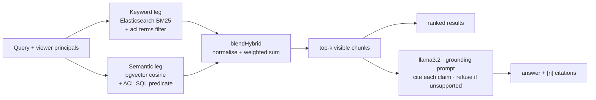

# IndexFlow

Permission-aware hybrid workspace search with grounded, cited answers — and an evaluation harness
that measures whether any of it actually works.


## What it is

Upload documents, search them, and get answers that cite their sources — where **every result is
filtered by who you are**. A document is visible to you only if it is public, yours, or shared
with you or a group you belong to, and that rule is enforced independently on *both* retrieval
legs rather than applied as a filter after the fact.

The part worth looking at is the measurement. Retrieval quality, answer groundedness, permission
leakage and latency each have a runnable eval with a pass/fail gate, run in CI on every pull
request. All LLMs run locally through Ollama — no API keys.


## How it works

A query fans out to two independent retrieval legs and the results are blended:



**Retrieval.** Documents are chunked semantically, embedded locally with
`Xenova/all-MiniLM-L6-v2` (384-dim, ONNX in-process), and written to two stores: Postgres with a
pgvector HNSW index for the semantic leg, and Elasticsearch for BM25. `lib/hybrid.ts` normalises
each leg's scores and combines them at a keyword weight of 0.55, chosen by a sweep on the eval's
tuning split only.

**Permissions** (`lib/acl.ts`). A viewer resolves to principals — `public`, `user:<id>`,
`group:<id>` — and each document carries the matching ACL token set, denormalised onto its
Elasticsearch chunks and derivable in SQL. Visible when the two sets intersect: the keyword leg
enforces it with a `terms` filter, the semantic leg with a SQL predicate, so neither can return
what the other would hide. Generation only sees chunks that survived the filter.

**Ingestion** is asynchronous: upload stores the original to MinIO and enqueues a BullMQ job; a
worker extracts text (`.md`/`.txt`/`.pdf`), chunks, embeds, and writes Postgres. Elasticsearch is
never written directly — the same transaction records a **transactional outbox** event, and a
projector (`lib/outbox.ts`) brings the keyword index in line by re-reading current state. Events
carry no payload, so retries are idempotent and a permission change can't be clobbered by a stale
snapshot; a reconciler sweeps for drift and repairs it.

**Answers** come from a local `llama3.2:3b` under a grounding prompt requiring `[n]` citations and
refusal when the context does not support an answer.

### Run it locally

Needs Node 22+, pnpm 9+, and Docker. Ollama is optional — answers and the generation eval only.

```bash
pnpm install
pnpm db:up                                   # Postgres, Redis, Elasticsearch, MinIO
pnpm db:migrate
cp apps/web/.env.example apps/web/.env       # set AUTH_SECRET; Google OAuth for sign-in
pnpm dev                                     # http://localhost:3000
pnpm worker                                  # required for uploads to index
pnpm seed                                    # optional demo corpus (needs SEED_TOKEN)
```

**Public demo mode.** `DEMO_MODE=1` makes a deployment safe to expose: `/signin` offers "Continue
as guest", mutations refuse with 403, and `/api/answer` returns real permission-filtered citations
plus an explanation instead of generating. Off unless set. See `.env.example`.

## Results

> **Every number below comes from [`apps/web/eval/RESULTS.md`](apps/web/eval/RESULTS.md)** — the
> captured output of a single dated run (2026-07-26), with the exact command for each. That file
> is the only source of truth for measurements in this repo. **Do not edit numbers here by hand;
> re-run the evals and update that file.**

| What | Command | Result |
|---|---|---|
| Retrieval quality | `pnpm --filter @indexflow/web eval` | held-out: semantic **MRR 0.94**, hybrid 0.85, keyword 0.73 |
| Answer groundedness | `pnpm --filter @indexflow/web eval:rag` | faithfulness **98%**, relevance 100%, citations 100%, refusal **92%** |
| Permission leaks | `pnpm --filter @indexflow/web acl:leak` | **9/9** pass, no leaks across either leg |
| Sharing lifecycle | `pnpm --filter @indexflow/web acl:sharing` | **8/8** pass |
| Direct object access | `pnpm --filter @indexflow/web acl:dao` | **13/13** pass — by-id fetch/delete/upload and job listings are gated |
| Cross-store consistency | `pnpm --filter @indexflow/web consistency:check` | **8/8** pass — no lost revokes, no false "ready", drift repaired |
| Adversarial | `pnpm --filter @indexflow/web eval:adversarial` | **0/30** unauthorised disclosures, **0/10** prompt-injection leaks |
| Latency at scale | `pnpm --filter @indexflow/web bench:latency` | p50 flat 1k→100k chunks: semantic 2.4–2.9 ms, hybrid 8.6–10.2 ms |

Retrieval is measured on **34 held-out queries**; the blend weight is chosen on a separate
30-query tuning split, so the numbers are not scored on the data that selected them. Generation
uses 20 answerable + 12 unanswerable questions. 17 documents, 8 GB Mac, local Docker.

**Hybrid does not beat both single strategies, and this README used to claim it did.** On held-out
queries semantic alone leads (MRR 0.94 vs hybrid 0.85). Hybrid is best for *exact-match* queries
(R@1 95%, MRR 1.00) but loses more on paraphrases than it gains there. The earlier 0.96 came from
tuning the blend weight on the same 34 queries it was then scored on, over an easier set. Fixing
the selection criterion moved it 0.86 → 0.85, so this is not an artifact of how the weight is
picked. Reasoning in `RESULTS.md`. Note the interval: 0.85 [0.75–0.94] — gaps of a few points on
34 queries are noise, not a ranking.

**Reranking is off, because it made things worse.** A `bge-reranker-base` cross-encoder pass over
the blended top-10 scores **MRR 0.73 against plain hybrid's 0.85**, demoting the correct document
on 13 of 64 queries. It stays in the eval as a measured negative result rather than being quietly
deleted.

## Limitations

Evidence the system works on a small labelled fixture set, not production performance.

- **Small fixtures.** 64 retrieval queries over 17 documents (30 tuning / 34 held-out) and 32
  generation questions. Retrieval now has a proper held-out split; **generation does not yet** —
  its numbers are still whole-set. Confidence intervals are wide at this size.
- **The benchmark was made harder on purpose.** 30 queries were added in the IF-3 pass, and the
  added paraphrases were written with minimal lexical overlap with their sources. That is a fair
  test of paraphrase handling but it shifts the benchmark toward semantic retrieval, so these
  numbers are not comparable to the earlier ones.
- **Three 100% scores mean "no failures at this size"**, not "solved". The generation eval's two
  actual failures are printed in `RESULTS.md` rather than averaged away.
- **The latency benchmark uses synthetic vectors** and a fixed vocabulary. It measures latency,
  not quality, at scale. Its "index throughput" is bulk-load speed, not real ingestion.
- **The generator is a 3B model** over 6 contexts. A larger model would score differently.
- **Gate floors sit just under current numbers**, so a pass means "has not regressed", never
  "meets an external bar".
- **Not production-hardened.** Single-node everything, and evaluation runs on local fixtures
  rather than production traffic. Tested by 29 unit, 17 integration and 7 browser tests in CI.
- **Rate limiting is in-memory**, so limits are per process and reset on restart. It stops
  accidental hammering, not a distributed attacker; real protection belongs at the edge. The
  one-at-a-time concurrency cap on the eval endpoints is what actually protects the host.
- **One known telemetry bug:** the adversarial eval's `Average input tokens: 0` is a harness
  defect, not a measurement.

## Layout

```
apps/web/  app/ routes+UI · lib/ retrieve·hybrid·embed·es·acl·rag·outbox · eval/ harnesses
           + RESULTS.md (canonical numbers) · bench/ latency · worker/ ingestion + projector
infra/     docker-compose + Dockerfile · improvements.txt: phased hardening roadmap
```

MIT licensed.
