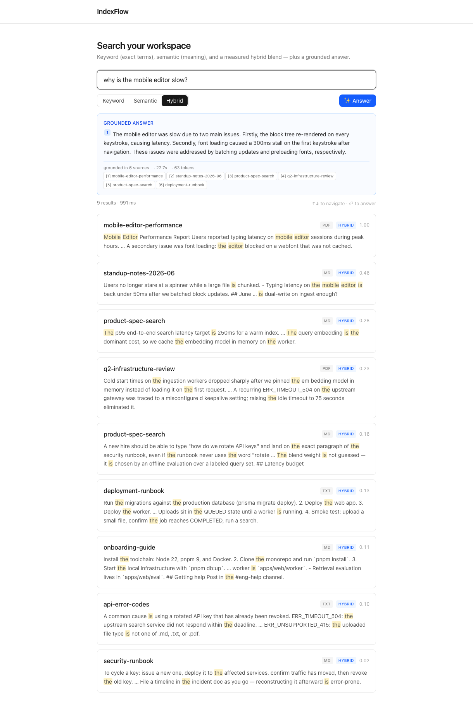
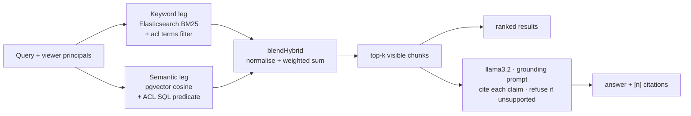

# IndexFlow

Permission-aware hybrid workspace search with grounded, cited answers — and an evaluation harness
that measures whether any of it actually works.


## What it is

Upload documents, search them, and get answers that cite their sources — where **every result is
filtered by who you are**. A document is visible to you only if it is public, yours, or shared
with you or a group you belong to, and that rule is enforced independently on *both* retrieval
legs rather than applied as a filter after the fact.

The part worth looking at is the measurement. Retrieval quality, answer groundedness, permission
leakage and latency each have a runnable eval with a pass/fail gate. All LLMs run locally through
Ollama — no API keys.



## How it works

A query fans out to two independent retrieval legs and the results are blended:



**Retrieval.** Documents are chunked semantically, embedded locally with
`Xenova/all-MiniLM-L6-v2` (384-dim, ONNX in-process), and written to two stores: Postgres with a
pgvector HNSW index for the semantic leg, and Elasticsearch for BM25. `lib/hybrid.ts` normalises
each leg's scores and combines them at a keyword weight of 0.45, chosen by a sweep on the eval's
tuning split only, at production retrieval depth.

**Permissions** (`lib/acl.ts`). A viewer resolves to principals — `public`, `user:<id>`,
`group:<id>` — and each document carries the matching ACL token set, denormalised onto its
Elasticsearch chunks and derivable in SQL. Visible when the two sets intersect: the keyword leg
enforces it with a `terms` filter, the semantic leg with a SQL predicate, so neither can return
what the other would hide. Generation only sees chunks that survived the filter.

**Ingestion** is asynchronous: upload stores the original to MinIO and enqueues a BullMQ job; a
worker extracts text (`.md`/`.txt`/`.pdf`), chunks, embeds, and writes Postgres. Elasticsearch is
never written directly — the same transaction records a **transactional outbox** event, and a
projector (`lib/outbox.ts`) brings the keyword index in line by re-reading current state. Events
carry no payload, so retries are idempotent and a permission change can't be clobbered by a stale
snapshot; a reconciler sweeps for drift and repairs it.

**Answers** come from a local `llama3.2:3b` under a grounding prompt requiring `[n]` citations and
refusal when the context does not support an answer.

### Run it locally

Needs Node 22+, pnpm 9+, and Docker. Ollama is optional — answers and the generation eval only.

```bash
pnpm install
pnpm db:up                                   # Postgres, Redis, Elasticsearch, MinIO
pnpm db:migrate
cp apps/web/.env.example apps/web/.env       # set AUTH_SECRET; Google OAuth for sign-in
pnpm dev                                     # http://localhost:3000
pnpm worker                                  # required for uploads to index
pnpm seed                                    # optional demo corpus (needs SEED_TOKEN)
```

**Public demo mode.** `DEMO_MODE=1` makes a deployment safe to expose: `/signin` offers "Continue
as guest", mutations refuse with 403, and `/api/answer` returns real permission-filtered citations
plus an explanation instead of generating. Off unless set. See `.env.example`.

## Results

> **Every number below comes from [`apps/web/eval/RESULTS.md`](apps/web/eval/RESULTS.md)** — captured
> output with the exact command and CI run id for each. Retrieval and the scale runs are dated
> 2026-08-05; the security, generation and latency evals 2026-07-26. That file is the only source
> of truth for measurements in this repo, and it keeps superseded numbers struck through with their
> reason rather than deleting them. **Do not edit numbers here by hand; re-run the evals and update
> that file.** Method and pre-registered predictions are in
> [`docs/eval/WORKLOG.md`](docs/eval/WORKLOG.md).

| What | Command | Result |
|---|---|---|
| Retrieval quality | `pnpm --filter @indexflow/web eval` | held-out: semantic **MRR 0.97**, hybrid+rerank 0.93, hybrid 0.89, keyword 0.75 — saturated, see below |
| Retrieval at scale | `BEIR_SUBSET=scifact … eval:scale` | BEIR SciFact, 5,183 docs: hybrid **nDCG@10 0.707**, above published BM25 (0.665) |
| Metric correctness | `python3 eval/crosscheck.py` | agrees with NIST `trec_eval` to machine epsilon, no correction |
| Answer groundedness | `pnpm --filter @indexflow/web eval:rag` | faithfulness **98%** (human-calibrated); relevance 100%, citations 100%\*, refusal **92%** (LLM-judged) |
| Judge calibration | `pnpm --filter @indexflow/web judge:calibrate` | 40 blind human labels: **90%** agreement, κ **0.29** — \*citation judge is lenient |
| Permission leaks | `pnpm --filter @indexflow/web acl:leak` | **9/9** pass, no leaks across either leg |
| Sharing lifecycle | `pnpm --filter @indexflow/web acl:sharing` | **8/8** pass |
| Direct object access | `pnpm --filter @indexflow/web acl:dao` | **13/13** pass — by-id fetch/delete/upload and job listings are gated |
| Cross-store consistency | `pnpm --filter @indexflow/web consistency:check` | **8/8** pass — no lost revokes, no false "ready", drift repaired |
| Adversarial | `pnpm --filter @indexflow/web eval:adversarial` | **0/30** unauthorised disclosures, **0/10** prompt-injection leaks |
| Latency at scale | `pnpm --filter @indexflow/web bench:latency` | p50 flat 1k→100k chunks: semantic 2.4–2.9 ms, hybrid 8.6–10.2 ms |

In-domain retrieval is measured on **33 of 34 held-out queries** — one has no relevant document and
is excluded from every ranking metric rather than scored as a miss, which is `trec_eval`'s
convention. The blend weight is chosen on a separate 30-query tuning split, and **every** gate row
is scored on held-out data; four of six previously included the tuning queries. At scale, the same
stack is run against BEIR SciFact and NFCorpus, whose relevance judgments are third-party.
Generation uses 20 answerable + 12 unanswerable questions with judges audited against 40 blind
human labels — see the caveat below. Retrieval runs on CI (`ubuntu-latest`); generation and
latency on local Docker.

**Whether hybrid helps depends on whether one leg dominates — and this README used to state the
in-domain answer as if it were general.** Measured on three corpora with a paired bootstrap:

| corpus | keyword vs semantic | hybrid vs both |
|---|---|---|
| in-domain (17 docs) | semantic **+0.22**, dominant | **−0.08, significantly worse** |
| BEIR SciFact (5,183 docs) | +0.015, not significant | **+0.056 / +0.071, significant** |
| BEIR NFCorpus (3,633 docs) | +0.008, not significant | **+0.032 / +0.023, significant** |

Hybrid is worth running when neither leg dominates and is actively harmful when one does. On the
tiny in-domain corpus semantic alone leads, so blending drags it down; on both public corpora the
legs are statistically tied and blending significantly beats both. Earlier versions of this file
reported only the first row and generalised from it.

**The in-domain benchmark is saturated.** R@5 sits at 100% of its attainable ceiling for semantic,
hybrid and hybrid+rerank simultaneously, and the bootstrap interval on hybrid R@5 is [100%, 100%].
Every metric is now printed next to that ceiling, because on this label set `P@3 = 37%` is a
perfect score and `R@5 = 100%` is not an achievement. Comparative claims come from the BEIR runs.

**Overlapping intervals were misread as "no difference".** This file previously said gaps of a few
points are noise. Both strategies are scored on the same queries, so the comparison is paired: the
semantic−hybrid gap is **+0.08 [0.01, 0.16]** and excludes zero. The old framing understated a real
result.

**Reranking is implemented but off by default, and its benefit is not statistically supported.**
It scores MRR 0.93 against plain hybrid's 0.89, but the paired interval is **+0.03 [−0.03, 0.10]**,
which includes zero at n=33. The point estimate is positive in every configuration tested, so it
may well help — 33 queries cannot show it.

**Retrieval depth is not the lever either.** Sweeping `CANDIDATE_LIMIT` on NFCorpus from 30 to 100
raises the reachable pool by a third but moves R@6 from 14.4% to 14.1% and nDCG@10 by 0.7 points:
the extra candidates are never ranked high enough to be consumed. It stays at 30. At k=6 hybrid
retrieves 14.4% against a label ceiling of 50.2%, so the headroom is in *ordering* the pool it
already has — how much is an open question, not a claim.

**The citation judge is lenient, so treat citations 100% as an upper bound.** A blind 40-row human
audit put `bespoke-minicheck` at 100% agreement on faithfulness (κ = 1.00), but `qwen2.5` passed
all 8 sampled citation rows where the human rejected 2. The audit also found one refusal the judge
scored wrong in the *strict* direction, meaning 92% refusal correctness is if anything understated.
Overall agreement 90%, κ 0.29. Full breakdown, including why three per-surface κ values read 0.00
for statistical rather than quality reasons, is in `RESULTS.md`.

## Limitations

Evidence the system works on a small labelled fixture set, not production performance.

- **The in-domain corpus is 17 single-chunk documents**, so "retrieval" there is a 17-way
  classification problem and the benchmark is saturated. This is the binding constraint on every
  in-domain number, and the reason the BEIR runs exist. 64 retrieval queries (30 tuning / 34
  held-out) and 32 generation questions. Generation still has **no held-out split**.
- **The BEIR corpora are out of domain.** SciFact is scientific claim verification, NFCorpus is
  nutrition literature. They show the retrieval stack is competitive against public baselines; they
  say nothing about permission-aware workspace search, which is the actual product.
- **Generation quality is unmeasured at scale** — 32 questions against 17 documents. Nothing
  measures end-to-end answer quality on a realistic corpus, which is what a user experiences.
- **The in-domain relevance labels have never been audited.** The LLM judges were calibrated
  against a blind human; the relevance judgments themselves rest on one person's unaudited opinion.
- **The benchmark was made harder on purpose.** 30 queries were added in the IF-3 pass, and the
  added paraphrases were written with minimal lexical overlap with their sources. That is a fair
  test of paraphrase handling but it shifts the benchmark toward semantic retrieval, so these
  numbers are not comparable to the earlier ones.
- **Three 100% scores mean "no failures at this size"**, not "solved" — and one of them is worse
  than that. The generation eval's two actual failures are printed in `RESULTS.md` rather than
  averaged away, and a blind 40-row human audit (`judge:export` → `judge:calibrate`) showed the
  citation judge passing rows a human rejected. Citations 100% is an upper bound, not a result.
  Faithfulness is the one generation metric that survived the audit intact (κ = 1.00).
- **The audit itself is small.** 40 rows, of which only 2 carried a minority-class judge verdict —
  the report contained no more. Kappa draws its power from disagreement opportunities, so this
  audit can catch a lenient judge (it did) but cannot certify a good one.
- **The latency benchmark uses synthetic vectors** and a fixed vocabulary. It measures latency,
  not quality, at scale. Its "index throughput" is bulk-load speed, not real ingestion.
- **The generator is a 3B model** over 6 contexts. A larger model would score differently.
- **Gate floors sit just under current numbers**, so a pass means "has not regressed", never
  "meets an external bar".
- **Not production-hardened.** Single-node everything, and evaluation runs on local fixtures
  rather than production traffic. CI covers build, unit, integration, Playwright, eval gates,
  container builds, CodeQL, and dependency review.
- **Rate limiting is in-memory**, so limits are per process and reset on restart. It stops
  accidental hammering, not a distributed attacker; real protection belongs at the edge. The
  one-at-a-time concurrency cap on the eval endpoints is what actually protects the host.
- **One historical telemetry caveat:** the captured adversarial run's `Average input tokens: 0`
  was a harness defect. The code now records Ollama prompt tokens; re-run the benchmark before
  quoting the input-token number.

## Layout

```
apps/web/  app/ routes+UI · lib/ retrieve·hybrid·embed·es·acl·rag·outbox · eval/ harnesses
           + RESULTS.md (canonical numbers) · bench/ latency · worker/ ingestion + projector
docs/      operations · ADRs · incident template · deterministic demo · ROADMAP.md
infra/     docker-compose + Dockerfile
```

MIT licensed.
