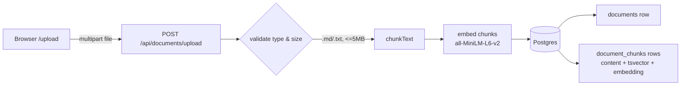
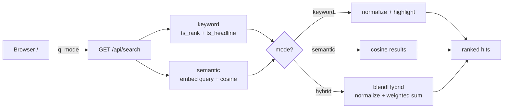

# IndexFlow

**Hybrid workspace search — keyword + semantic retrieval over your files, with the blend weight chosen by measurement instead of guesswork.**

IndexFlow lets you upload documents, indexes their text two complementary ways, and
searches across them with a single ranked, highlighted result list. It ships with a
live evaluation page that scores keyword vs semantic vs hybrid retrieval on a labeled
query set, so every ranking decision is backed by numbers.

> **Status: Step 5 of 7.** Working end to end locally: upload → manage → search
> (keyword / semantic / hybrid) → benchmark. Async indexing, Elasticsearch, MinIO,
> PDF support, and deployment are the remaining steps — see [Roadmap](#roadmap).

---

## Table of contents

- [Why hybrid search](#why-hybrid-search)
- [Features](#features)
- [Architecture](#architecture)
- [Tech stack](#tech-stack)
- [Repository layout](#repository-layout)
- [Component deep dive](#component-deep-dive)
- [The three search modes](#the-three-search-modes)
- [Evaluation harness](#evaluation-harness)
- [Quick start](#quick-start)
- [Scripts](#scripts)
- [Environment variables](#environment-variables)
- [Development workflow & CI](#development-workflow--ci)
- [Design decisions (FAQ)](#design-decisions-faq)
- [Current limitations](#current-limitations)
- [Roadmap](#roadmap)

---

## Why hybrid search

Two kinds of search have opposite strengths:

| | Good at | Bad at |
|---|---|---|
| **Keyword** (full-text) | Exact strings: error codes, API names, config keys, IDs | Paraphrases — it matches words, not meaning |
| **Semantic** (vector) | Meaning: "typing feels slow" finds "input latency" | Exact tokens, and it can misrank when a document's embedding is "diluted" |

Postgres full-text uses `plainto_tsquery`, which **ANDs** every term — so one
non-matching word ("dark **mode**" against a doc that says "dark themes") drops the
result entirely. That brittleness is real and measured in this repo (keyword MRR 0.48).

**Hybrid** blends both. It keeps keyword's exact-match guarantees and semantic's
paraphrase coverage, and in the evaluation it beats both individual strategies
(MRR 0.98 vs semantic 0.96 vs keyword 0.48).

---

## Features

- **Upload & index** `.md` / `.txt` files; text is chunked and embedded on upload.
- **Three search modes** — keyword, semantic, hybrid — switchable in the UI.
- **Highlighted snippets** via Postgres `ts_headline`, rendered XSS-safe.
- **Keyboard-navigable** results (↑/↓/Esc) with focus ring and scroll-into-view.
- **Document management** page: list everything indexed, delete with cascade.
- **Live evaluation page** (`/eval`): recall@k, MRR, a hybrid weight sweep, and a
  pass/fail quality gate — run in the browser.
- **CI quality gate**: the same eval runs on every PR, so "green" means retrieval
  didn't regress.

### Screenshots

<!-- Add screenshots here, e.g. the /eval page and a hybrid search result. -->
<!--  -->
<!--  -->

_Run `pnpm dev` and open `/eval`, then click **Run evaluation** — that page is the
clearest single view of what the project does._

---

## Architecture

IndexFlow is a single Next.js application (UI + API routes) backed by one Postgres
database that does double duty: full-text search **and** vector search (via the
`pgvector` extension). There is no separate search cluster or object store yet — that's
deliberate for the current step (see [Design decisions](#design-decisions-faq)).

### Ingestion pipeline



### Search pipeline



---

## Tech stack

| Layer | Choice | Why |
|---|---|---|
| Framework | **Next.js 15** (App Router) + **React 19** | One app for UI and API routes; server routes run on Node |
| Language | **TypeScript** (strict) | Typed end to end |
| Styling | **Tailwind CSS v4** | Fast, consistent styling with zero custom CSS framework |
| Database | **PostgreSQL 16** + **pgvector** | One store for both full-text and vector search |
| ORM | **Prisma 6** | Typed schema + migrations; raw SQL where pgvector needs it |
| Embeddings | **Transformers.js** (`all-MiniLM-L6-v2`, 384-dim) | Real semantic vectors, in-process, **no API key**, runs in CI |
| Tooling | **pnpm** workspace, **tsx** | Workspace scripts; run TS scripts without a build step |
| CI | **GitHub Actions** | Build + evaluation gate on every PR |

---

## Repository layout

```
indexflow/
├── apps/web/                      # the Next.js application (only package today)
│   ├── app/
│   │   ├── layout.tsx             # shell + top nav
│   │   ├── page.tsx               # "/"          search UI (keyword/semantic/hybrid)
│   │   ├── upload/page.tsx        # "/upload"    file upload + session history
│   │   ├── documents/page.tsx     # "/documents" list + delete indexed docs
│   │   ├── eval/page.tsx          # "/eval"      live retrieval benchmark
│   │   ├── globals.css            # Tailwind import + <mark> styles
│   │   └── api/
│   │       ├── documents/upload/route.ts   # POST  upload + synchronous index
│   │       ├── documents/route.ts          # GET   list documents
│   │       ├── documents/[id]/route.ts     # DELETE a document (cascade)
│   │       ├── search/route.ts             # GET   keyword | semantic | hybrid
│   │       └── eval/route.ts               # GET   run evaluation, return report
│   ├── lib/
│   │   ├── prisma.ts              # PrismaClient singleton
│   │   ├── chunk.ts               # text → overlapping chunks
│   │   ├── embed.ts               # local embedding model wrapper
│   │   └── hybrid.ts              # pure keyword+semantic blend
│   ├── eval/
│   │   ├── corpus.json            # labeled fixture corpus (17 docs)
│   │   ├── queries.json           # 27 queries with gold-relevant docs
│   │   ├── harness.ts             # shared eval logic (CLI + API)
│   │   └── run.ts                 # CLI: print table + apply quality gate
│   ├── prisma/
│   │   ├── schema.prisma          # models: Document, DocumentChunk
│   │   └── migrations/            # init, FTS GIN index, embeddings + HNSW index
│   └── scripts/backfill-embeddings.ts  # embed chunks created before Step 2
├── infra/docker-compose.yml       # Postgres (pgvector image) on port 5440
├── .github/workflows/ci.yml       # build + eval jobs
├── plan.md                        # build plan and direction
└── pnpm-workspace.yaml
```

---

## Component deep dive

### Monorepo (`pnpm-workspace.yaml`, root `package.json`)

A pnpm workspace with one package today (`apps/web`). Root scripts proxy into it
(`pnpm dev`, `pnpm build`, `pnpm db:up`, …). The workspace exists so `apps/api` (a
BullMQ worker) and `packages/shared` can be added in Step 6 without restructuring.

### Infrastructure (`infra/docker-compose.yml`)

One service: Postgres using the **`pgvector/pgvector:pg16`** image, so the vector
extension is available without a custom build. It is published on host port **5440**
(to avoid colliding with a local Postgres on 5432), with a named volume for
persistence and a healthcheck. The compose project is named `indexflow` so it never
touches your other containers.

### Data model (`prisma/schema.prisma` + migrations)

Two tables:

- **`documents`** — `id`, `title`, `fileName`, `fileType`, `status`
  (`UPLOADED | INDEXING | INDEXED | FAILED`), `uploadedAt`, `indexedAt`.
- **`document_chunks`** — `id`, `documentId` (FK, cascade delete), `chunkIndex`,
  `content`, `tokenCount`, `embedding vector(384)`, `createdAt`.

Three migrations build it up:

1. `init` — the two tables.
2. `fts_gin_index` — a **functional GIN index** on
   `to_tsvector('english', content)` for fast full-text search (this can't be
   expressed in `schema.prisma`, so it's a hand-written migration).
3. `add_embeddings` — enables the `vector` extension, adds the `embedding` column,
   and creates an **HNSW** index with `vector_cosine_ops` for fast nearest-neighbour
   search.

The `embedding` column is declared in Prisma as `Unsupported("vector(384)")?` so
Prisma tracks it (no migration drift) while reads/writes go through raw SQL.

### Chunking (`lib/chunk.ts`)

Splits text on blank lines into paragraphs, then packs paragraphs into chunks of
**~180 words** with a **30-word overlap** between adjacent chunks (so a match near a
boundary keeps its surrounding context). Oversized paragraphs are windowed on their
own. Token counts are estimated (~0.75 words/token) for display and budgeting.

### Embeddings (`lib/embed.ts`)

Wraps Transformers.js running **`Xenova/all-MiniLM-L6-v2`** (384 dimensions) fully
in-process via ONNX. Vectors are **mean-pooled and L2-normalized**, so cosine
similarity reduces to a dot product. The pipeline is lazy-loaded and cached on
`globalThis` (survives dev hot-reloads). First call downloads the model (~25 MB) once;
warm inference is single-digit milliseconds. `toVectorLiteral()` formats a `number[]`
as a `pgvector` literal (`[0.1,0.2,…]`).

`@huggingface/transformers` is marked in `serverExternalPackages` (next.config) so the
native runtime is loaded at runtime instead of being bundled by webpack.

### Hybrid blend (`lib/hybrid.ts`)

A pure, dependency-free function shared by the search route and the eval harness:

1. **Min-max normalize** each strategy's scores to `[0,1]` (keyword `ts_rank` and
   cosine similarity live on different scales).
2. **Weighted sum**: `weight · keyword + (1 − weight) · semantic`. Items missing from
   a list contribute 0, so documents found by **both** strategies are naturally
   rewarded.
3. Items with a zero blended score are dropped, which keeps the endpoints honest:
   `weight = 1` behaves like keyword-only, `weight = 0` like semantic-only.

`DEFAULT_HYBRID_WEIGHT = 0.5` — chosen by the eval weight sweep, not guessed.

### Prisma client (`lib/prisma.ts`)

A standard singleton that reuses one `PrismaClient` across hot reloads in development
(prevents connection exhaustion).

### API routes

- **`POST /api/documents/upload`** — accepts a multipart `file`, validates extension
  (`.md`/`.txt`) and size (≤ 5 MB), chunks the text, embeds the chunks, and writes the
  document plus chunks **inside a transaction**. Embedding happens before any write, so
  a model failure leaves no partial document. (Synchronous today; becomes a BullMQ job
  in Step 6.)
- **`GET /api/search?q=&mode=&fileType=`** — runs keyword, semantic, or hybrid (see
  [below](#the-three-search-modes)). Returns ranked hits with snippet, score, source
  label, and total latency.
- **`GET /api/documents`** — lists documents (newest first) with chunk counts.
- **`DELETE /api/documents/[id]`** — deletes a document; chunks cascade. 404 if missing.
- **`GET /api/eval`** — runs the evaluation harness on demand and returns the report
  (used by the `/eval` page).

### Pages

- **`/`** — search box, mode toggle (Keyword / Semantic / **Hybrid**, default hybrid),
  keyboard navigation, highlighted result cards with file-type/source badges and
  scores, latency readout, and tailored empty/error/first-visit states.
- **`/upload`** — click-to-upload with indexing state, validation errors, and a
  session list of what was indexed.
- **`/documents`** — table of indexed files (title, type, chunk count, date) with
  delete-and-confirm and an empty state.
- **`/eval`** — a **Run evaluation** button that calls `/api/eval` and renders the
  overall metrics table, the by-query-kind breakdown, the weight-sweep bar chart, and
  the quality gate.

---

## The three search modes

All three read from the same `document_chunks` table.

**Keyword** — `to_tsvector('english', content) @@ plainto_tsquery(q)`, ranked by
`ts_rank`, with snippets from `ts_headline`. `ts_rank` is unbounded, so scores are
min-max normalized for display.

**Semantic** — the query is embedded with the same MiniLM model, then chunks are
ranked by cosine distance (`embedding <=> queryVector`); score = `1 − distance`.

**Hybrid** — fetch candidates from both, blend with `blendHybrid` (see above), and
return the top results. Snippets prefer the keyword candidate (it carries the
highlighted `ts_headline`) and fall back to escaped content for semantic-only hits.

**XSS-safe highlighting:** `ts_headline` wraps matches in sentinel tokens
(`@@HL_START@@` / `@@HL_END@@`); the server HTML-escapes the whole snippet and only
then swaps the sentinels for `<mark>`. Raw chunk content can never inject markup.

---

## Evaluation harness

The centerpiece. It answers "is hybrid actually better, and at what weight?" with data.

**Dataset** (`eval/corpus.json`, `eval/queries.json`): a 17-document fixture corpus and
27 queries, each tagged `exact` or `paraphrase` and labeled with its gold-relevant
document. The corpus includes adversarial cases — exact identifiers and an
embedding-dilution case (a long error-code reference vs an on-topic distractor) — so
hybrid's advantage is real, not contrived.

**Isolation** (`eval/harness.ts`): the corpus is seeded inside a transaction that is
**rolled back** at the end, so the eval never touches real data. Searches are scoped to
the corpus document ids, and index scans are disabled (`SET LOCAL enable_indexscan =
off`) so semantic ranking is **exact** (brute-force KNN), making results deterministic.

**Metrics**: recall@1/3/5 and MRR per strategy, plus a per-query-kind breakdown.

**Weight sweep**: hybrid MRR is computed across keyword weights 0.0 → 1.0; the best is
chosen (tie-break toward 0.5) and surfaced as the recommended `DEFAULT_HYBRID_WEIGHT`.

**Quality gate**: floors sit below current numbers to catch regressions (e.g. "hybrid
MRR ≥ best single strategy"). `pnpm eval` exits non-zero on failure, which fails CI.

**Current results (MRR):**

```
strategy   R@1   R@3   R@5    MRR
keyword     48%   48%   48%   0.48
semantic    93%  100%  100%   0.96
hybrid      96%  100%  100%   0.98   ← beats both

by query kind (R@1):   keyword   semantic   hybrid
exact                     73%       93%       100%
paraphrase                17%       92%        92%
```

Semantic misranks `ERR_QUOTA_4096` (the diluted reference doc loses to an on-topic
distractor); keyword's exact match rescues it, so hybrid hits 100% on exact queries.

Run it yourself:

```bash
pnpm --filter @indexflow/web eval     # CLI table + gate
# or open /eval in the browser
```

---

## Quick start

**Prerequisites:** Node 22+, pnpm 9+, Docker.

```bash
# 1. install
pnpm install

# 2. start Postgres (pgvector) on port 5440
pnpm db:up

# 3. apply migrations
pnpm db:migrate

# 4. run the app
pnpm dev                  # http://localhost:3000
```

Open `/upload` to index a file, `/` to search it, `/documents` to manage, and `/eval`
to benchmark. The first search or upload downloads the embedding model (~25 MB) once.

If you indexed files before embeddings existed, backfill them:

```bash
pnpm --filter @indexflow/web embed:backfill
```

---

## Scripts

**Root:**

| Script | Action |
|---|---|
| `pnpm dev` | Start the Next.js dev server |
| `pnpm build` | Production build (generates Prisma client, type-checks) |
| `pnpm db:up` / `pnpm db:down` | Start / stop the Postgres container |
| `pnpm db:migrate` | Apply Prisma migrations |
| `pnpm db:generate` | Regenerate the Prisma client |

**`apps/web`:**

| Script | Action |
|---|---|
| `pnpm --filter @indexflow/web eval` | Run the evaluation + quality gate |
| `pnpm --filter @indexflow/web embed:backfill` | Embed chunks with a NULL embedding |
| `pnpm --filter @indexflow/web start` | Serve the production build |

---

## Environment variables

Defined in `apps/web/.env` (see `apps/web/.env.example`):

| Variable | Purpose |
|---|---|
| `DATABASE_URL` | Postgres connection string (defaults to the docker-compose DB on port 5440) |
| `OPENAI_API_KEY` | Unused today — placeholder for a future OpenAI embedding provider |

Embeddings run locally, so no API key is required to use the app.

---

## Development workflow & CI

`main` is **protected**: no direct pushes, all changes go through pull requests, and
two checks must pass before merging.

**CI (`.github/workflows/ci.yml`)** runs on every PR:

- **`build`** — `pnpm install` → `prisma generate` → `next build` (type-checks).
- **`eval`** — spins up a Postgres (pgvector) service, applies migrations, and runs
  `pnpm eval`. A retrieval regression below the quality floors fails the build.

Both are **required status checks**, enforced on admins, with 0 required approvals
(so a solo maintainer can self-merge once CI is green).

---

## Design decisions (FAQ)

**Why local embeddings instead of the OpenAI API?** No API key, no per-call cost, and
the eval runs in CI offline. It also demonstrates the full pipeline end to end. The
schema and `lib/embed.ts` are structured so an OpenAI provider can be added later.

**Why 384 dimensions, not 1536?** That's MiniLM's native size. Smaller vectors are
cheaper to store and compare; quality is strong for this corpus (see the eval).

**Why Postgres for both full-text and vector search?** One store, one transaction
boundary, and it's enough to prove the hybrid thesis. Elasticsearch (richer
highlighting/filters) and MinIO (raw file storage) come in Step 6, with the eval
guarding against regressions during the swap.

**Why roll back the eval transaction?** So the benchmark can run against the live
database (including from the `/eval` page) without ever polluting indexed data.

**Why does the eval disable index scans?** HNSW is approximate; disabling it forces
exact KNN so eval numbers are deterministic and reproducible.

---

## Current limitations

- **Local only** — runs via Docker + `pnpm dev`; not deployed yet (Step 7).
- **`.md` / `.txt` only** — PDF extraction is Step 7.
- **Synchronous indexing** — done inside the upload request; large files would block.
  Async BullMQ ingestion is Step 6.
- **Extracted text only** — original files aren't stored yet (MinIO is Step 6).
- **No authentication / multi-tenancy.**
- Upload size cap: 5 MB.

---

## Roadmap

| Step | Scope | Status |
|---|---|---|
| 1 | Thin vertical slice: upload + keyword search | ✅ |
| 2 | Embeddings + pgvector semantic search | ✅ |
| 3 | Evaluation harness + CI quality gate | ✅ |
| 4 | Hybrid blend + live `/eval` page | ✅ |
| 5 | Search UX polish + documents management | ✅ |
| 6 | Real infra: Elasticsearch, MinIO, BullMQ | ⏳ |
| 7 | PDF support, realistic seed, deploy to a live URL | ⏳ |

See [`plan.md`](./plan.md) for the full build plan.
