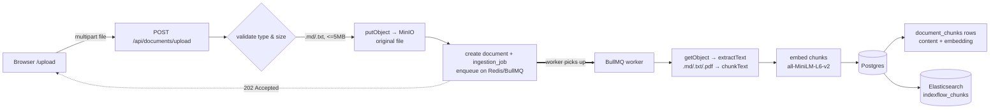
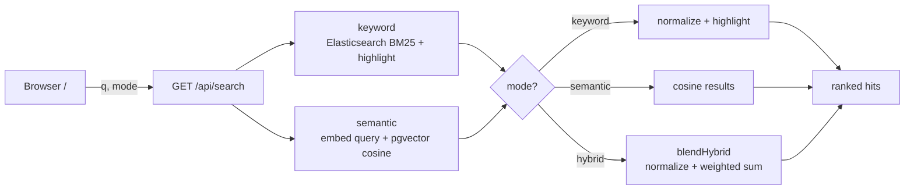

# IndexFlow

**Hybrid workspace search — keyword + semantic retrieval over your files, with the blend weight chosen by measurement instead of guesswork.**

IndexFlow lets you upload documents, indexes their text two complementary ways, and
searches across them with a single ranked, highlighted result list. It ships with a
live evaluation page that scores keyword vs semantic vs hybrid retrieval on a labeled
query set, so every ranking decision is backed by numbers.

> **Status: Step 7 of 7 (deployment pending).** Working end to end locally: upload
> (`.md` / `.txt` / `.pdf`) → async indexing on a BullMQ worker → manage → search
> (keyword / semantic / hybrid) → benchmark. Keyword search runs on **Elasticsearch**
> (BM25 + highlighting), original files live in **MinIO**, and ingestion runs off-request
> on a **Redis/BullMQ** queue. A one-command demo seed loads a realistic mixed-format
> corpus through the real pipeline. Live deployment is the remaining step — see
> [Roadmap](#roadmap).

---

## Table of contents

- [Why hybrid search](#why-hybrid-search)
- [Features](#features)
- [Architecture](#architecture)
- [Tech stack](#tech-stack)
- [Repository layout](#repository-layout)
- [Component deep dive](#component-deep-dive)
- [The three search modes](#the-three-search-modes)
- [Evaluation harness](#evaluation-harness)
- [Quick start](#quick-start)
- [Scripts](#scripts)
- [Environment variables](#environment-variables)
- [Development workflow & CI](#development-workflow--ci)
- [Design decisions (FAQ)](#design-decisions-faq)
- [Current limitations](#current-limitations)
- [Roadmap](#roadmap)

---

## Why hybrid search

Two kinds of search have opposite strengths:

| | Good at | Bad at |
|---|---|---|
| **Keyword** (BM25) | Exact strings: error codes, API names, config keys, IDs | Paraphrases — it matches words, not meaning |
| **Semantic** (vector) | Meaning: "typing feels slow" finds "input latency" | Exact tokens, and it can misrank when a document's embedding is "diluted" |

Keyword search runs on **Elasticsearch** (BM25 with `or` term semantics), which ranks a
document by how many query terms it matches and how rare they are — strong on exact
identifiers but still blind to meaning: a query for "typing feels slow" won't match a
doc that only says "input latency" (keyword paraphrase R@1 is just 83%, vs 92% semantic).

**Hybrid** blends both. It keeps keyword's exact-match guarantees and semantic's
paraphrase coverage, and in the evaluation it beats both individual strategies
(MRR 0.98 vs semantic 0.96 vs keyword 0.92).

---

## Features

- **Upload & index** `.md` / `.txt` / `.pdf` files (PDF text extracted with unpdf); text
  is chunked and embedded off-request on a BullMQ worker, then mirrored into
  Elasticsearch for keyword search.
- **One-command demo seed** (`pnpm seed`) that uploads a realistic mixed-format corpus
  through the real upload → worker → index pipeline (no hardcoded rows).
- **Three search modes** — keyword, semantic, hybrid — switchable in the UI.
- **Highlighted snippets** via Elasticsearch highlighting, rendered XSS-safe.
- **Ingestion jobs** page (`/jobs`) with live status (queued → running → completed/failed).
- **Keyboard-navigable** results (↑/↓/Esc) with focus ring and scroll-into-view.
- **Document management** page: list everything indexed, delete with cascade.
- **Live evaluation page** (`/eval`): recall@k, MRR, a hybrid weight sweep, and a
  pass/fail quality gate — run in the browser.
- **CI quality gate**: the same eval runs on every PR, so "green" means retrieval
  didn't regress.

### Screenshots

<!-- Add screenshots here, e.g. the /eval page and a hybrid search result. -->
<!--  -->
<!--  -->

_Run `pnpm dev` and open `/eval`, then click **Run evaluation** — that page is the
clearest single view of what the project does._

---

## Architecture

IndexFlow is a Next.js application (UI + API routes) plus a standalone **BullMQ worker**.
Postgres is the source of truth and the vector store (via the `pgvector` extension);
**Elasticsearch** owns keyword search, BM25 ranking, and highlighting; original files
live in **MinIO** (S3-compatible object storage); **Redis** backs the ingestion queue.
Chunk ids are generated in app code so the same id keys a Postgres row and an ES
document — that's how hybrid correlates keyword + semantic hits (see
[Design decisions](#design-decisions-faq)).

### Ingestion pipeline (async)



### Search pipeline



---

## Tech stack

| Layer | Choice | Why |
|---|---|---|
| Framework | **Next.js 15** (App Router) + **React 19** | One app for UI and API routes; server routes run on Node |
| Language | **TypeScript** (strict) | Typed end to end |
| Styling | **Tailwind CSS v4** | Fast, consistent styling with zero custom CSS framework |
| Database | **PostgreSQL 16** + **pgvector** | Source of truth for documents/chunks + vector search |
| Keyword search | **Elasticsearch 8** | BM25 ranking, highlighting, file-type filters |
| Queue | **Redis 7** + **BullMQ** | Off-request ingestion jobs with retries |
| Object storage | **MinIO** (S3-compatible) | Stores the original uploaded files |
| ORM | **Prisma 6** | Typed schema + migrations; raw SQL where pgvector needs it |
| Embeddings | **Transformers.js** (`all-MiniLM-L6-v2`, 384-dim) | Real semantic vectors, in-process, **no API key**, runs in CI |
| Tooling | **pnpm** workspace, **tsx** | Workspace scripts; run TS scripts without a build step |
| CI | **GitHub Actions** | Build + evaluation gate on every PR |

---

## Repository layout

```
indexflow/
├── apps/web/                      # the Next.js application (only package today)
│   ├── app/
│   │   ├── layout.tsx             # shell + top nav
│   │   ├── page.tsx               # "/"          search UI (keyword/semantic/hybrid)
│   │   ├── upload/page.tsx        # "/upload"    file upload + session history
│   │   ├── documents/page.tsx     # "/documents" list + delete indexed docs
│   │   ├── eval/page.tsx          # "/eval"      live retrieval benchmark
│   │   ├── jobs/page.tsx          # "/jobs"      live ingestion job status
│   │   ├── globals.css            # Tailwind import + <mark> styles
│   │   └── api/
│   │       ├── documents/upload/route.ts   # POST  upload → MinIO + enqueue ingestion job
│   │       ├── documents/route.ts          # GET   list documents
│   │       ├── documents/[id]/route.ts     # DELETE a document (cascade + ES + storage)
│   │       ├── documents/[id]/file/route.ts# GET   stream the original file
│   │       ├── jobs/route.ts               # GET   list ingestion jobs
│   │       ├── jobs/[id]/route.ts          # GET   poll a single job's status
│   │       ├── search/route.ts             # GET   keyword | semantic | hybrid
│   │       └── eval/route.ts               # GET   run evaluation, return report
│   ├── worker/index.ts            # BullMQ ingestion worker (consumes the queue)
│   ├── seed/corpus/               # demo corpus: mixed .md / .txt / .pdf files
│   ├── lib/
│   │   ├── prisma.ts              # PrismaClient singleton
│   │   ├── storage.ts             # MinIO (S3) object storage
│   │   ├── queue.ts               # BullMQ queue + Redis connection
│   │   ├── ingest.ts              # shared indexer: extract → chunk → embed → PG + ES
│   │   ├── extract.ts             # text extraction (.md/.txt utf-8, .pdf via unpdf)
│   │   ├── es.ts                  # Elasticsearch client, indexing, BM25 keyword search
│   │   ├── chunk.ts               # text → overlapping chunks
│   │   ├── embed.ts               # local embedding model wrapper
│   │   └── hybrid.ts              # pure keyword+semantic blend
│   ├── eval/
│   │   ├── corpus.json            # labeled fixture corpus (17 docs)
│   │   ├── queries.json           # 27 queries with gold-relevant docs
│   │   ├── harness.ts             # shared eval logic (ephemeral ES + rolled-back PG)
│   │   └── run.ts                 # CLI: print table + apply quality gate
│   ├── prisma/
│   │   ├── schema.prisma          # models: Document, DocumentChunk, IngestionJob
│   │   └── migrations/            # init, FTS GIN index, embeddings + HNSW, ingestion_jobs
│   └── scripts/
│       ├── backfill-embeddings.ts # embed chunks created before Step 2
│       ├── backfill-es.ts         # (re)index all chunks into Elasticsearch
│       └── seed.ts                # upload the demo corpus through the real pipeline
├── infra/docker-compose.yml       # Postgres, Redis, Elasticsearch, MinIO
├── .github/workflows/ci.yml       # build + eval jobs
├── plan.md                        # build plan and direction
└── pnpm-workspace.yaml
```

---

## Component deep dive

### Monorepo (`pnpm-workspace.yaml`, root `package.json`)

A pnpm workspace with one package today (`apps/web`), which contains both the Next.js
app and the BullMQ worker (`worker/index.ts`, run via `pnpm worker`). Root scripts proxy
into it (`pnpm dev`, `pnpm worker`, `pnpm build`, `pnpm db:up`, …).

### Infrastructure (`infra/docker-compose.yml`)

Four services: **Postgres** (pgvector), **Redis** (BullMQ), **Elasticsearch** (keyword),
and **MinIO** (files). **Postgres** uses the **`pgvector/pgvector:pg16`** image (vector
extension available without a custom build), published on host port **5440** to avoid colliding
with a local Postgres on 5432, with a named volume and a healthcheck. **Redis 7**
(host **6380**) backs the BullMQ queue. **Elasticsearch 8** (host **9200**, single-node,
security disabled, 512 MB heap) owns the keyword index. **MinIO** (S3-compatible object
storage) runs the S3 API on host port **9100** and its web console on **9101**. All use
named volumes; the compose project is named `indexflow` so it never touches your other
containers.

### Data model (`prisma/schema.prisma` + migrations)

Three tables:

- **`documents`** — `id`, `title`, `fileName`, `fileType`, `status`
  (`UPLOADED | INDEXING | INDEXED | FAILED`), `uploadedAt`, `indexedAt`.
- **`document_chunks`** — `id`, `documentId` (FK, cascade delete), `chunkIndex`,
  `content`, `tokenCount`, `embedding vector(384)`, `createdAt`.
- **`ingestion_jobs`** — `id`, `documentId` (FK, cascade), `status`
  (`QUEUED | RUNNING | COMPLETED | FAILED`), `error`, `startedAt`, `completedAt`,
  `createdAt`.

Migrations build it up:

1. `init` — documents + document_chunks.
2. `fts_gin_index` — a functional GIN index on `to_tsvector('english', content)`.
   (Legacy from Steps 1–5; keyword search moved to Elasticsearch in Step 6c, so this is
   no longer on the query path but is kept for the eval/back-compat.)
3. `add_embeddings` — enables the `vector` extension, adds the `embedding` column,
   and creates an **HNSW** index with `vector_cosine_ops` for fast nearest-neighbour
   search.
4. `ingestion_jobs` — the async ingestion job table (Step 6b).

The `embedding` column is declared in Prisma as `Unsupported("vector(384)")?` so
Prisma tracks it (no migration drift) while reads/writes go through raw SQL.

### Chunking (`lib/chunk.ts`)

Splits text on blank lines into paragraphs, then packs paragraphs into chunks of
**~180 words** with a **30-word overlap** between adjacent chunks (so a match near a
boundary keeps its surrounding context). Oversized paragraphs are windowed on their
own. Token counts are estimated (~0.75 words/token) for display and budgeting.

### Embeddings (`lib/embed.ts`)

Wraps Transformers.js running **`Xenova/all-MiniLM-L6-v2`** (384 dimensions) fully
in-process via ONNX. Vectors are **mean-pooled and L2-normalized**, so cosine
similarity reduces to a dot product. The pipeline is lazy-loaded and cached on
`globalThis` (survives dev hot-reloads). First call downloads the model (~25 MB) once;
warm inference is single-digit milliseconds. `toVectorLiteral()` formats a `number[]`
as a `pgvector` literal (`[0.1,0.2,…]`).

`@huggingface/transformers` is marked in `serverExternalPackages` (next.config) so the
native runtime is loaded at runtime instead of being bundled by webpack.

### Hybrid blend (`lib/hybrid.ts`)

A pure, dependency-free function shared by the search route and the eval harness:

1. **Min-max normalize** each strategy's scores to `[0,1]` (keyword BM25 and
   cosine similarity live on different scales).
2. **Weighted sum**: `weight · keyword + (1 − weight) · semantic`. Items missing from
   a list contribute 0, so documents found by **both** strategies are naturally
   rewarded.
3. Items with a zero blended score are dropped, which keeps the endpoints honest:
   `weight = 1` behaves like keyword-only, `weight = 0` like semantic-only.

`DEFAULT_HYBRID_WEIGHT = 0.4` — chosen by the eval weight sweep, not guessed.

### Object storage (`lib/storage.ts`)

An S3 client (`@aws-sdk/client-s3`, path-style) pointed at MinIO. Exposes
`putObject` / `getObject` / `deleteObject` and lazily creates the bucket on first use.

### Keyword index (`lib/es.ts`)

The Elasticsearch client and the `indexflow_chunks` index (mapping: `chunk_id`,
`document_id`, `chunk_index`, `title`, `file_type`, `content`, `created_at`). Exposes
`ensureChunkIndex`, `indexChunks` (bulk, keyed by chunk id), `deleteDocumentChunks`, and
`keywordSearch` (BM25 `multi_match` + highlight fragments). `createEphemeralIndex` /
`deleteIndex` let the eval harness spin up a throwaway index per run.

### Ingestion queue & worker (`lib/queue.ts`, `lib/ingest.ts`, `worker/index.ts`)

Upload enqueues an `ingestion` job on Redis via BullMQ and returns `202`. The worker
(`pnpm worker`) consumes it: marks the job `RUNNING`, calls the shared `ingestDocument`
(download from MinIO → chunk → embed → write to Postgres → mirror to Elasticsearch), then
marks it `COMPLETED`. Jobs retry with exponential backoff (3 attempts) and only flip to
`FAILED` once attempts are exhausted. Chunk ids are generated in `ingest.ts` so the same
id keys the Postgres row and the ES document.
Uploads store the original file under `documents/<id>/<fileName>`; the key is saved on
the document row so files can be streamed back or deleted.

### Prisma client (`lib/prisma.ts`)

A standard singleton that reuses one `PrismaClient` across hot reloads in development
(prevents connection exhaustion).

### API routes

- **`POST /api/documents/upload`** — accepts a multipart `file`, validates extension
  (`.md`/`.txt`/`.pdf`) and size (≤ 10 MB), stores the original in MinIO, creates the
  document and a `QUEUED` ingestion job, enqueues it on BullMQ, and returns
  **`202 Accepted`**. The worker does the extract → chunk → embed →
  store-to-Postgres → mirror-to-Elasticsearch work.
- **`GET /api/search?q=&mode=&fileType=`** — runs keyword, semantic, or hybrid (see
  [below](#the-three-search-modes)). Returns ranked hits with snippet, score, source
  label, and total latency.
- **`GET /api/documents`** — lists documents (newest first) with chunk counts.
- **`DELETE /api/documents/[id]`** — deletes a document; chunks cascade in Postgres and
  are removed from Elasticsearch and MinIO (best-effort). 404 if missing.
- **`GET /api/jobs` / `GET /api/jobs/[id]`** — list recent ingestion jobs / poll one
  job's status (used by the `/jobs` page and the upload page).
- **`GET /api/eval`** — runs the evaluation harness on demand and returns the report
  (used by the `/eval` page).

### Pages

- **`/`** — search box, mode toggle (Keyword / Semantic / **Hybrid**, default hybrid),
  keyboard navigation, highlighted result cards with file-type/source badges and
  scores, latency readout, and tailored empty/error/first-visit states.
- **`/upload`** — click-to-upload with indexing state, validation errors, and a
  session list of what was indexed.
- **`/documents`** — table of indexed files (title, type, chunk count, date) with
  delete-and-confirm and an empty state.
- **`/eval`** — a **Run evaluation** button that calls `/api/eval` and renders the
  overall metrics table, the by-query-kind breakdown, the weight-sweep bar chart, and
  the quality gate.

---

## The three search modes

Keyword reads from Elasticsearch; semantic reads from `document_chunks` in Postgres.
Both stores are keyed by the same chunk ids, so hybrid can blend them.

**Keyword** — an Elasticsearch `multi_match` over `content` (and a lightly boosted
`title`) with `or` term semantics, ranked by BM25. BM25 is unbounded, so scores are
min-max normalized for display.

**Semantic** — the query is embedded with the same MiniLM model, then chunks are
ranked by cosine distance (`embedding <=> queryVector`); score = `1 − distance`.

**Hybrid** — fetch candidates from both, blend with `blendHybrid` (see above), and
return the top results. Snippets prefer the keyword candidate (it carries the ES
highlight fragments) and fall back to escaped content for semantic-only hits.

**XSS-safe highlighting:** Elasticsearch wraps matches in sentinel tokens
(`@@HL_START@@` / `@@HL_END@@`); the server HTML-escapes the whole snippet and only
then swaps the sentinels for `<mark>`. Raw chunk content can never inject markup.

---

## Evaluation harness

The centerpiece. It answers "is hybrid actually better, and at what weight?" with data.

**Dataset** (`eval/corpus.json`, `eval/queries.json`): a 17-document fixture corpus and
27 queries, each tagged `exact` or `paraphrase` and labeled with its gold-relevant
document. The corpus includes adversarial cases — exact identifiers and an
embedding-dilution case (a long error-code reference vs an on-topic distractor) — so
hybrid's advantage is real, not contrived.

**Isolation** (`eval/harness.ts`): the harness mirrors production — keyword candidates
come from a real Elasticsearch BM25 query against an **ephemeral index** (created and
torn down per run), and semantic candidates come from pgvector inside a transaction that
is **rolled back** at the end. Neither store keeps eval data. Semantic index scans are
disabled (`SET LOCAL enable_indexscan = off`) so ranking is **exact** (brute-force KNN),
making results deterministic.

**Metrics**: recall@1/3/5 and MRR per strategy, plus a per-query-kind breakdown.

**Weight sweep**: hybrid MRR is computed across keyword weights 0.0 → 1.0; the best is
chosen (tie-break toward 0.5) and surfaced as the recommended `DEFAULT_HYBRID_WEIGHT`
(currently **0.4** — BM25 keyword scores shifted the optimum down from the old 0.5).

**Quality gate**: floors sit below current numbers to catch regressions (e.g. "hybrid
MRR ≥ best single strategy"). `pnpm eval` exits non-zero on failure, which fails CI.

**Current results (MRR):**

```
strategy   R@1   R@3   R@5    MRR
keyword     89%   93%  100%   0.92
semantic    93%  100%  100%   0.96
hybrid      96%  100%  100%   0.98   ← beats both

by query kind (R@1):   keyword   semantic   hybrid
exact                     93%       93%       100%
paraphrase                83%       92%        92%
```

Elasticsearch BM25 (with `or` term semantics) makes keyword far stronger than naive
Postgres full-text was (`plainto_tsquery` ANDs every term — one off word dropped the
result; keyword MRR was 0.48). Keyword still trails on paraphrases (R@1 83%), and
semantic misranks `ERR_QUOTA_4096` (the diluted reference doc loses to an on-topic
distractor). Hybrid takes the best of both and hits 100% R@1 on exact queries.

Run it yourself:

```bash
pnpm --filter @indexflow/web eval     # CLI table + gate
# or open /eval in the browser
```

---

## Quick start

**Prerequisites:** Node 22+, pnpm 9+, Docker.

```bash
# 1. install
pnpm install

# 2. start infra: Postgres (pgvector, :5440), Redis (:6380),
#    Elasticsearch (:9200), MinIO (:9100, console :9101)
pnpm db:up

# 3. apply migrations
pnpm db:migrate

# 4. run the app AND the ingestion worker (two terminals)
pnpm dev                  # http://localhost:3000
pnpm worker               # BullMQ worker — indexes uploads

# 5. (optional) load a realistic mixed-format demo corpus through the real pipeline
pnpm seed                 # needs the app + worker running; BASE_URL overrides the target
```

Open `/upload` to index a file (`.md` / `.txt` / `.pdf`), `/jobs` to watch ingestion,
`/` to search it, `/documents` to manage, and `/eval` to benchmark. The first search or
upload downloads the embedding model (~25 MB) once. **The worker must be running** for
uploads to index.

If you have documents that predate a store (e.g. indexed before Elasticsearch existed),
backfill them:

```bash
pnpm --filter @indexflow/web embed:backfill   # chunks with a NULL embedding → pgvector
pnpm --filter @indexflow/web es:backfill      # all chunks → Elasticsearch keyword index
```

---

## Scripts

**Root:**

| Script | Action |
|---|---|
| `pnpm dev` | Start the Next.js dev server |
| `pnpm worker` | Start the BullMQ ingestion worker |
| `pnpm seed` | Load the demo corpus through the real pipeline (needs app + worker) |
| `pnpm build` | Production build (generates Prisma client, type-checks) |
| `pnpm db:up` / `pnpm db:down` | Start / stop all infra containers (Postgres, Redis, Elasticsearch, MinIO) |
| `pnpm db:migrate` | Apply Prisma migrations |
| `pnpm db:generate` | Regenerate the Prisma client |

**`apps/web`:**

| Script | Action |
|---|---|
| `pnpm --filter @indexflow/web eval` | Run the evaluation + quality gate |
| `pnpm --filter @indexflow/web embed:backfill` | Embed chunks with a NULL embedding |
| `pnpm --filter @indexflow/web es:backfill` | (Re)index all chunks into Elasticsearch |
| `pnpm --filter @indexflow/web worker` | Run the BullMQ ingestion worker |
| `pnpm --filter @indexflow/web start` | Serve the production build |

---

## Environment variables

Defined in `apps/web/.env` (see `apps/web/.env.example`):

| Variable | Purpose |
|---|---|
| `DATABASE_URL` | Postgres connection string (defaults to the docker-compose DB on port 5440) |
| `REDIS_URL` | Redis/BullMQ connection (default `redis://localhost:6380`) |
| `ES_URL` | Elasticsearch endpoint (default `http://localhost:9200`) |
| `ES_INDEX` | Keyword index name (default `indexflow_chunks`) |
| `MINIO_ENDPOINT` | MinIO S3 API endpoint (default `http://localhost:9100`) |
| `MINIO_ACCESS_KEY` / `MINIO_SECRET_KEY` | MinIO credentials |
| `MINIO_BUCKET` | Bucket for original files (default `indexflow`) |
| `OPENAI_API_KEY` | Unused today — placeholder for a future OpenAI embedding provider |

Embeddings run locally, so no API key is required to use the app.

---

## Development workflow & CI

`main` is **protected**: no direct pushes, all changes go through pull requests, and
two checks must pass before merging.

**CI (`.github/workflows/ci.yml`)** runs on every PR:

- **`build`** — `pnpm install` → `prisma generate` → `next build` (type-checks).
- **`eval`** — spins up Postgres (pgvector) and Elasticsearch services, applies
  migrations, and runs `pnpm eval` (real BM25 keyword + pgvector semantic). A retrieval
  regression below the quality floors fails the build.

Both are **required status checks**, enforced on admins, with 0 required approvals
(so a solo maintainer can self-merge once CI is green).

---

## Design decisions (FAQ)

**Why local embeddings instead of the OpenAI API?** No API key, no per-call cost, and
the eval runs in CI offline. It also demonstrates the full pipeline end to end. The
schema and `lib/embed.ts` are structured so an OpenAI provider can be added later.

**Why 384 dimensions, not 1536?** That's MiniLM's native size. Smaller vectors are
cheaper to store and compare; quality is strong for this corpus (see the eval).

**Why Elasticsearch for keyword when Postgres full-text worked?** BM25 with `or` term
semantics is dramatically better than `plainto_tsquery`'s all-AND matching (keyword MRR
0.48 → 0.92 on the same corpus), plus ES gives richer highlighting and filters. Postgres
stays the source of truth and the vector store; ES is a derived keyword index. The eval
was made ES-backed at the same time, so the same quality gate guards the swap.

**Why generate chunk ids in app code?** So one id keys both the Postgres row and the
Elasticsearch document. Hybrid blends keyword + semantic candidates by chunk id, which
only works if both stores agree on ids.

**How does PDF ingestion work?** `lib/extract.ts` parses PDFs with **unpdf** (a
serverless-friendly build of pdf.js) and returns plain text that flows through the exact
same chunk → embed → index path as text files. Extracted text is sanitized to strip null
bytes / control chars, which pdf.js occasionally emits and which Postgres `TEXT` rejects.
Scanned image-only PDFs have no text layer, so they won't extract (no OCR).

**Why seed by uploading, not by inserting rows?** The seed script (`pnpm seed`) POSTs each
file in `seed/corpus` to the real upload endpoint, so the demo data goes through MinIO,
the queue, the worker, Postgres, and Elasticsearch — the same path a user's file takes.
No hardcoded search results, per the project's rules.

**Why roll back the eval transaction (and use an ephemeral ES index)?** So the benchmark
can run against the live database (including from the `/eval` page) without ever
polluting indexed data in either store.

**Why does the eval disable index scans?** HNSW is approximate; disabling it forces
exact KNN so eval numbers are deterministic and reproducible.

---

## Current limitations

- **Local only** — runs via Docker + `pnpm dev`; not deployed to a public URL yet.
- **`.md` / `.txt` / `.pdf`** — scanned PDFs (image-only, no text layer) won't extract;
  there is no OCR.
- **Worker must be running** — uploads sit in `QUEUED` until `pnpm worker` picks them up.
- **No authentication / multi-tenancy.**
- Upload size cap: 10 MB.

---

## Roadmap

| Step | Scope | Status |
|---|---|---|
| 1 | Thin vertical slice: upload + keyword search | ✅ |
| 2 | Embeddings + pgvector semantic search | ✅ |
| 3 | Evaluation harness + CI quality gate | ✅ |
| 4 | Hybrid blend + live `/eval` page | ✅ |
| 5 | Search UX polish + documents management | ✅ |
| 6 | Real infra: MinIO (6a), BullMQ worker (6b), Elasticsearch (6c) | ✅ |
| 7 | PDF support ✅ · realistic demo seed ✅ · deploy to a live URL ⏳ | 🚧 |

See [`plan.md`](./plan.md) for the full build plan.
