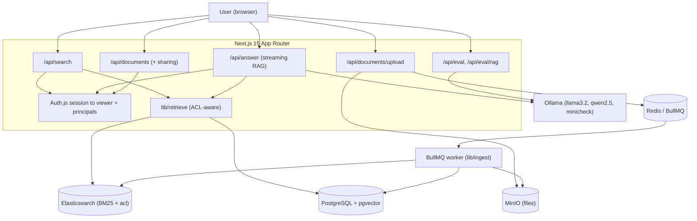

# Design Summary — IndexFlow

## System Overview
IndexFlow is a permission-aware hybrid search engine with a grounded RAG layer. It indexes documents two complementary ways (BM25 keyword in Elasticsearch, vector semantic in Postgres/pgvector), blends them with a measured weight, and generates cited answers with a local LLM that refuses when the retrieved context is insufficient. Every retrieval and every citation is filtered by the querying user's access rights. It is a single Next.js application plus a standalone BullMQ ingestion worker, backed by Postgres, Elasticsearch, Redis, MinIO, and Ollama, all runnable locally via Docker Compose.

## Architecture Diagram

## Component Breakdown

### Shared retriever — `lib/retrieve.ts`
- **Purpose:** single ACL-aware retrieval path used by both search and RAG; keyword + semantic candidate fetchers and the blend live in one place.
- **Key files:** `lib/retrieve.ts`, `lib/hybrid.ts`, `lib/es.ts`, `lib/embed.ts`, `lib/acl.ts`.
- **Inputs:** query string, `k`, a required `Viewer` (userId + principals), optional fileType filter.
- **Outputs:** ranked candidates / hydrated `RetrievedContext[]` (full chunk content for grounding).
- **Dependencies:** Elasticsearch (BM25 + `terms` acl filter), Postgres/pgvector (cosine + SQL visibility predicate), Prisma.

### Hybrid blend — `lib/hybrid.ts`
- **Purpose:** pure, dependency-free score fusion (min-max normalize each strategy, weighted sum, drop zeros).
- **Inputs:** two scored candidate lists + weight. **Outputs:** merged, re-scored list.
- **Notes:** `DEFAULT_HYBRID_WEIGHT = 0.4`, chosen by the eval weight sweep; shared by the search route and the eval harness so ranking is identical in prod and eval.

### Embeddings — `lib/embed.ts`
- **Purpose:** in-process semantic vectors via Transformers.js `all-MiniLM-L6-v2` (384-dim), mean-pooled + L2-normalized.
- **Inputs:** text[]. **Outputs:** number[][] (+ `toVectorLiteral` for pgvector). **Dependencies:** `@huggingface/transformers` (marked `serverExternalPackages`). No API key.

### Keyword index — `lib/es.ts`
- **Purpose:** Elasticsearch client + `indexflow_chunks` index; BM25 `multi_match`, highlighting, and an `acl` keyword field with a `terms` filter.
- **Inputs:** chunks to index (with acl tokens), search queries. **Outputs:** BM25 hits with highlighted snippets. **Dependencies:** `@elastic/elasticsearch`.

### Permissions — `lib/acl.ts`, `lib/sharing.ts`
- **Purpose:** principal model (`public`, `user:<id>`, `group:<id>`), `viewerFrom`, `aclTokens`, `documentVisibilityWhere` (Prisma-query twin of the SQL predicate), `syncDocumentAcl`, and owner-only sharing mutations (`setPublic`, `addGrant`, `removeGrant`).
- **Inputs:** viewer/user id, document id, grant target. **Outputs:** principal sets, ACL tokens, updated sharing state. **Dependencies:** Prisma, `lib/es.ts` (ACL re-sync).

### LLM layer — `lib/llm.ts`, `lib/rag.ts`
- **Purpose:** the only provider-specific seam. `llm.ts` wraps Ollama for streaming generation and two judges (per-claim faithfulness via `bespoke-minicheck`, relevance/citation via `qwen2.5:7b`), plus model residency control (warm/unload). `rag.ts` wires retrieval → grounding prompt → stream.
- **Inputs:** question + contexts. **Outputs:** provider-neutral answer event stream / judge scores. **Dependencies:** `ollama`, `lib/retrieve.ts`.

### Async ingestion — `lib/ingest.ts`, `worker/index.ts`, `lib/queue.ts`
- **Purpose:** extract → chunk → embed → dual-write to Postgres (idempotent re-index) + Elasticsearch (with acl); jobs retry with exponential backoff.
- **Inputs:** documentId from a BullMQ job. **Outputs:** indexed chunks in both stores; job status transitions. **Dependencies:** BullMQ/Redis, MinIO, `lib/extract.ts`, `lib/chunk.ts`, `lib/embed.ts`, `lib/es.ts`.

### API routes — `app/api/*/route.ts`
- **Purpose:** search, streaming answer (NDJSON), documents list/delete/file/upload, owner-only sharing, jobs, eval, eval/rag, Auth.js handlers.
- **Inputs:** HTTP requests + session. **Outputs:** JSON / NDJSON streams. **Dependencies:** the libs above + `auth()`.

### Evaluation — `eval/*`
- **Purpose:** measured quality. Retrieval eval (recall@k, MRR, weight sweep, gate), RAG hallucination eval (LLM judges), ACL leak test, sharing lifecycle check.
- **Inputs:** labeled fixtures (`corpus.json`, `queries.json`, `answers.json`). **Outputs:** metric tables + pass/fail gates; leak/sharing PASS/FAIL. **Dependencies:** ephemeral ES index, rolled-back Postgres transaction, Ollama (RAG eval only).

## Key Design Decisions
- **Shared chunk ids across stores** — ids generated in app code so one id keys a Postgres row and an ES document; hybrid correlates keyword + semantic hits by id. (Explicit in `lib/ingest.ts`, README FAQ.)
- **Elasticsearch for keyword instead of Postgres full-text** — BM25 `or` term semantics beat `plainto_tsquery` all-AND matching (keyword MRR 0.48 → 0.92 on the same corpus). (README FAQ; migration history keeps the legacy FTS index.)
- **ACL enforced on both legs independently** — denormalized principal tokens + `terms` filter in ES (index-side), plus a SQL `EXISTS` predicate in Postgres; the shared retriever *requires* a viewer so new call sites can't skip it. (`lib/retrieve.ts`, `lib/acl.ts`.)
- **Local-only models (embeddings + LLMs)** — no API key, eval runs offline in CI, full pipeline demonstrated end to end; `lib/embed.ts` and `lib/llm.ts` are structured as swappable seams. *(Design intent stated in README; inferred rationale.)*
- **Generation ≠ judges** — `llama3.2` generates, `bespoke-minicheck` + `qwen2.5` judge, to avoid self-preference bias. (`lib/llm.ts`, `eval/rag-harness.ts`.)
- **Eval isolation** — retrieval eval runs BM25 against an ephemeral ES index and pgvector inside a rolled-back transaction with exact (index-scan-disabled) KNN, so it never pollutes data and is deterministic. (`eval/harness.ts`.)
- **Restrictive default visibility** — new uploads are private to the owner; a migration grandfathers pre-existing rows to public. (`prisma/migrations/*_permission_aware_acl`.)

## Tradeoffs
- **Two stores (PG + ES) → dual-write + consistency work** in exchange for best-in-class BM25 + highlighting alongside vector search; the code keeps Postgres as source of truth and ES as a derived index, and re-syncs ACL on sharing changes.
- **Denormalized ACL in ES → fast index-side filtering but must be kept in sync** (`syncDocumentAcl`, `es:backfill`); a mapping-drift edge case is explicitly handled in `ensureChunkIndex`.
- **Local small LLMs → no keys/cost and full offline demo, but weaker/less-defensible RAG quality** than frontier models; mitigated by measuring and by a swappable provider seam.
- **LLM-as-judge → scalable automated eval, but judge reliability is itself a limitation** on a 3B-class stack.

## Reliability / Error Handling
- **Async ingestion retries:** BullMQ jobs configured with `attempts: 3` and exponential backoff (`app/api/documents/upload/route.ts`); only flip to `FAILED` after attempts exhausted; jobs table tracks status/errors.
- **Idempotent re-index:** `ingestDocument` deletes prior chunks before writing (`lib/ingest.ts`).
- **Streaming resilience:** the answer route tolerates client disconnects and never leaks internal errors to the client, logging the real cause server-side (`app/api/answer/route.ts`).
- **Eval robustness:** the RAG harness phases models by residency and surfaces infra-errored items separately so an infrastructure failure can't masquerade as a 0% quality score (`eval/rag-harness.ts`, `eval/rag-run.ts`).
- **Validation:** upload validates file extension + size; `zod` is a dependency for input validation.
- **Gaps:** no unit/integration test framework; correctness relies on the eval harnesses + ACL check scripts.

## Security / Privacy Considerations
- **Authentication:** Auth.js (NextAuth v5) + Google OAuth; middleware protects pages (`middleware.ts`), API routes call `auth()` to resolve the viewer.
- **Access control:** per-document ACL (owner/public/user-grant/group-grant) enforced on both retrieval legs and on the documents/sharing/delete routes (owner-only mutations); proven by `eval/acl-leak.ts` (restricted content never retrieved or cited) and `eval/sharing-check.ts`.
- **Secrets:** configuration via env (`apps/web/.env`, documented in `.env.example`); `AUTH_SECRET`, OAuth client, DB/ES/MinIO creds are env-driven, not committed.
- **XSS:** Elasticsearch highlights use sentinel tokens; the server HTML-escapes then swaps to `<mark>`, so raw content can't inject markup (`app/api/search/route.ts`, `lib/es.ts`).
- **Note:** local dev uses ES with security disabled and default MinIO creds — appropriate for local, not production.

## Testing Strategy
- **No unit/integration test framework** (no Jest/Vitest/Playwright in dependencies).
- **Evaluation-as-tests:** `pnpm eval` (retrieval, gated in CI), `pnpm eval:rag` (RAG hallucination, on-demand), `pnpm acl:leak` (permission leak, deterministic), `pnpm acl:sharing` (sharing → visibility, deterministic). The ACL checks seed and tear down real fixtures in Postgres + Elasticsearch and drive the production retrieval/answer code paths (not reimplementations).
- **CI gate:** the retrieval eval runs on every PR against real Postgres + Elasticsearch service containers and fails the build below quality floors (`.github/workflows/ci.yml`, `eval/harness.ts`).

## Deployment / Runtime
- **Local:** `pnpm db:up` (Docker Compose: Postgres/pgvector :5440, Redis :6380, Elasticsearch :9200, MinIO :9100) → `pnpm db:migrate` → `pnpm dev` + `pnpm worker` → optional `pnpm seed`; optional Ollama for RAG. (`infra/docker-compose.yml`, root `package.json`.)
- **CI:** GitHub Actions `build` (install → prisma generate → next build/type-check) and `eval` (Postgres + Elasticsearch service containers → migrations → `pnpm eval`).
- **Production deploy:** not implemented (roadmap item). No cloud IaC, container registry, or orchestration in the repo.
