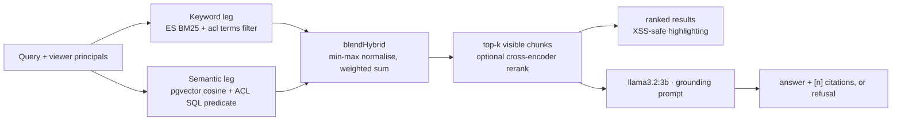

# IndexFlow — field guide

A permission-aware hybrid document search engine with grounded, cited answers — and an evaluation
harness rigorous enough to have caught six defects in the project's own published numbers.

This is the A–Z reference: what the system is, how every part works, what has been measured, and
what has been withdrawn. It is compiled from the code and from the canonical measurement records.

> **Numbers.** Every figure here comes from [`apps/web/eval/RESULTS.md`](../apps/web/eval/RESULTS.md),
> which holds captured output with the exact command and CI run id for each. That file is the only
> source of truth for measurements in this repo. Do not edit numbers here by hand — re-run the eval
> and update that file. Findings summary: [`docs/eval/FINDINGS.md`](eval/FINDINGS.md). Method and
> pre-registered predictions: [`docs/eval/WORKLOG.md`](eval/WORKLOG.md).

**Contents**

1. [What IndexFlow is](#1-what-indexflow-is)
2. [The problem it solves](#2-the-problem-it-solves)
3. [Architecture](#3-architecture)
4. [Data model](#4-data-model)
5. [The retrieval stack](#5-the-retrieval-stack)
6. [Permissions](#6-permissions)
7. [Cross-store consistency](#7-cross-store-consistency)
8. [Answers and RAG](#8-answers-and-rag)
9. [Tech stack](#9-tech-stack)
10. [Product surface](#10-product-surface)
11. [Configuration](#11-configuration)
12. [Running it](#12-running-it)
13. [The evaluation harness](#13-the-evaluation-harness)
14. [Measured results](#14-measured-results)
15. [The self-audit](#15-the-self-audit)
16. [Claim ledger](#16-claim-ledger)
17. [Testing and CI](#17-testing-and-ci)
18. [Codebase map](#18-codebase-map)
19. [Build sequence](#19-build-sequence)
20. [Operations](#20-operations)
21. [Limitations](#21-limitations)
22. [Glossary](#22-glossary)

---

## 1. What IndexFlow is

Upload documents, search them three ways, and get answers that cite their sources — where every
result is filtered by who is asking.

A user uploads a document. The system stores the original bytes in object storage, queues an
ingestion job, and a worker extracts the text, chunks it, embeds it locally, and writes it into
**two** stores: Postgres with pgvector for semantic search, and Elasticsearch for BM25 keyword
search. A query fans out to both legs in parallel, the two result lists are blended into one
ranking, and a local LLM writes an answer that cites its passages or refuses when the retrieved
context does not support one.

Two things make it more than a RAG demo.

### Differentiator one: authorization is inside the search engines

A document is visible only if it is public, owned by the viewer, or shared with them directly or
through a group. That rule is enforced *independently inside both retrieval engines, before
ranking* — an Elasticsearch `terms` filter on a denormalised ACL field, and a SQL predicate in the
pgvector query's `WHERE` clause. It is not a post-filter applied to results after they come back,
which is the usual shortcut and the usual leak.

### Differentiator two: everything is measured, including the measurements

Retrieval quality, answer groundedness, permission leakage, latency, and ingestion throughput each
have a runnable evaluation with a pass/fail gate wired into CI. The metric implementations
themselves were cross-checked against NIST's `trec_eval` reference. And the harness was audited:
six defects were found in numbers the project had *already published*, and those numbers are now
struck through in the record rather than quietly deleted.

| | |
|---|---|
| Retrieval legs, independently ACL-filtered | **2** |
| Paid API calls | **0** — every model runs locally |
| Automated tests / CI jobs | **103 / 11** |
| Embeddings in the largest scale run | **195,980** |

Solo project, ~13,100 lines of TS/TSX, MIT licensed.

---

## 2. The problem it solves

Workspace search has a constraint that public web search does not: **the index is shared but the
visibility is not**. Ten thousand documents live in one corpus, and every one of them is visible to
a different subset of people. A search result that shouldn't have been shown is not a ranking bug —
it is a disclosure.

That constraint interacts badly with the standard RAG architecture in three specific ways, and
IndexFlow is built around all three:

1. **Post-filtering silently truncates results.** If you retrieve the top 30 and then drop what the
   viewer can't see, a viewer with narrow access gets a nearly empty result page while the index is
   full of things they *can* read. Both legs here filter before ranking, so the top-k is the top-k
   *of what the viewer can see*.
2. **Two search engines means two copies of the permission rule.** Hybrid search needs a keyword
   index and a vector index. Each has its own filtering mechanism, and they must agree exactly —
   because a leak on either leg is a leak, and generation inherits whatever retrieval returns.
3. **Permission changes race with indexing.** Embedding a document takes seconds. If a revoke lands
   during that window and the indexer writes an ACL snapshot it took *before* the work started, the
   revoke is silently clobbered. This is the dual-write consistency problem wearing a security
   costume, and it is the reason for the outbox in §7.

**Framing.** This is a solo portfolio project, not production software serving real users. The
evidence shows the system works on labelled fixture sets and public benchmark corpora — it says
nothing about production traffic. Every number in §14 carries the corpus size and hardware it was
measured on, because those are part of the claim rather than decoration.

---

## 3. Architecture

Two paths: an asynchronous upload path that ends in a projection, and a synchronous query path that
fans out and blends.




### The load-bearing decision: Postgres is the source of truth

Elasticsearch is **never written directly**. The transaction that writes chunks also writes a
transactional outbox event, and a separate projector brings the keyword index in line by *re-reading
current state* rather than replaying a stored payload. Recorded as
[ADR 0001](adr/0001-postgres-source-of-truth.md). §7 covers the mechanism in full.

### Services

| Service | Image | Role | Local port |
|---|---|---|---|
| Postgres | `pgvector/pgvector:pg16` | Source of truth; chunks, embeddings, ACL tables, outbox | 5440 |
| Elasticsearch | `elasticsearch:8.15.3` | Keyword projection; BM25, highlighting, ACL terms filter | 9200 |
| Redis | `redis:7-alpine` | BullMQ ingestion queue | 6380 |
| MinIO | `minio/minio` | S3-compatible storage for original uploaded files | 9100 / 9101 |
| Ollama | host install | Generation and judge models — optional, answers only | 11434 |

---

## 4. Data model

Ten Prisma migrations over PostgreSQL 16. Identity comes from the Auth.js adapter; everything below
`Document` is the project's own.

| Model | Purpose | Notable fields |
|---|---|---|
| `User` / `Account` / `Session` / `VerificationToken` | Auth.js Prisma adapter contract. `Account` also holds per-provider OAuth tokens. | `email` unique |
| `Document` | One uploaded file and its visibility state. | `status` (UPLOADED → INDEXING → INDEXED / FAILED), `storageKey`, `isPublic` (defaults **false**), `ownerId`, `aclVersion`, `contentVersion` |
| `DocumentChunk` | A ~180-word passage with its vector. Written via raw SQL because pgvector's type is unsupported by Prisma. | `embedding vector(384)`, `tokenCount`, unique on `(documentId, chunkIndex)` |
| `DocumentGrant` | One explicit share, to exactly one principal — a user *or* a group. | `userId` / `groupId`, guarded by a DB `CHECK` constraint since Prisma cannot express the XOR |
| `Group` / `GroupMember` | Named group with an owner; membership grants read access to everything shared with the group. | `ownerId` nullable — an ownerless group is deliberately unmanageable (see §6) |
| `OutboxEvent` | A payload-free signal that a document's projection is owed. | `reason`, `status`, `attempts`, `lastError`. **Intentionally has no foreign key to `Document`** — a deletion event must outlive its document |
| `IngestionJob` | Per-upload job record backing the `/jobs` status page. | `status`, `error`, `startedAt`, `completedAt` |

### The Elasticsearch mapping

Each ES document is one chunk, keyed by the same UUID as its Postgres row. Alongside `content`,
`title` and `file_type`, it carries three fields that exist purely for correctness:

- `acl` — the denormalised principal token list, indexed as `keyword` so it can be filtered with
  `terms`.
- `acl_version` and `content_version` — copied from the source document so the projector can tell a
  fresh write from one built on a stale snapshot, and so the reconciler can spot drift without
  re-reading content.

---

## 5. The retrieval stack

### Chunking — `lib/chunk.ts`

Text is split on paragraph boundaries and packed to a ~180-word target with a 30-word overlap;
oversized paragraphs are word-windowed on their own. The overlap means a match near a chunk edge
still has surrounding context. Token counts are estimated at ~0.75 words per token, which is good
enough for display and budgeting.

### Embedding — `lib/embed.ts`

`Xenova/all-MiniLM-L6-v2`, 384 dimensions, running through ONNX **in-process** — no API key, and no
network at query time after the first model download. Vectors are mean-pooled and L2-normalised, so
cosine similarity equals dot product.

> **A real bug, worth knowing.** `embed()` originally passed every text to the model in one call.
> transformers.js pads a batch to its longest sequence and allocates one tensor for the whole batch,
> so 11,562 chunks asked for roughly **4.5 GB** and the process was OOM-killed on a CI runner. This
> also affected the production ingest path, since the worker embeds every chunk of a document in one
> call. Fixed by batching internally at 64, which keeps peak allocation in the tens of megabytes
> with no measurable throughput loss.

### The keyword leg — `lib/es.ts`

Elasticsearch 8.15.3, BM25 via `multi_match` with a `title^2` boost, plus native highlighting. The
ACL `terms` filter sits in the `bool.filter` clause, so restricted chunks never reach the ranker at
all.

### The semantic leg — `lib/retrieve.ts`

A raw pgvector query: `ORDER BY dc.embedding <=> $vec LIMIT $k`, with the ACL predicate in the
`WHERE` clause and an HNSW index behind it. Both legs retrieve `CANDIDATE_LIMIT = 30` candidates.

### Fusion — `lib/hybrid.ts`

BM25 is unbounded; cosine similarity is not. Raw scores cannot be added, so each leg is min-max
normalised *within its own result list* and then combined linearly:

```
score(chunk) = w · norm(BM25) + (1 − w) · norm(cosine)     w = 0.45
```

The output is the **union** of both candidate sets keyed by chunk id; a chunk found by only one leg
contributes 0 for the other component. Items scoring 0 overall are dropped, which keeps the
endpoints honest — `w=1` behaves exactly like keyword-only and `w=0` like semantic-only, and a unit
test pins that.

**Why chunk ids are generated in application code.** The UUIDs are minted *before either write*, so
the same id keys the Postgres row and the Elasticsearch document. Without a shared id there is
nothing to blend on — you would be merging two lists that cannot be matched to one another. It is
one line of code and it is load-bearing for the entire hybrid design.

**How the weight was chosen.** Swept 0.00–1.00 in 0.05 steps **on a tuning split only**, then
reported on a held-out split that never influenced the choice. The selection criterion is the mean
of per-kind MRR — exact-match and paraphrase queries weighted equally — rather than pooled MRR,
because the tuning split is 17 exact / 13 paraphrase and pooling lets the larger kind decide the
weight.

The honest read: **the plateau is wide and flat.** Everything from 0.20 to 0.70 scores 0.98 on the
tuning split. 0.45 is a plateau centre, not a sharp optimum. This constant has drifted from the
sweep before — production once served 0.4 while every published hybrid number described 0.55 — so
the source file now carries that history as a comment.

**Why not Reciprocal Rank Fusion.** RRF fuses on *ranks*; this fuses on *normalised scores*. That
difference has a measured consequence: min-max is scale-free but not shape-free, so a deeper
candidate list has a lower minimum and normalisation compresses that leg's top toward 1.0. Measured,
the semantic leg's normalised second-place score rises from 0.565 at depth 10 to 0.659 at depth 17 —
the leg votes less decisively purely because it retrieved more. RRF would be immune to that. The
trade is deliberate (scores retain magnitude information that ranks discard), but RRF was never
implemented as a comparison, so which performs better here is genuinely unknown.

There is also a known wart, pinned by a unit test rather than hidden: the lowest-scoring hit in each
list normalises to exactly 0, making "retrieved last" indistinguishable from "not retrieved".
Patched experimentally; held-out results were unchanged.

### Reranking — `lib/rerank.ts`

A cross-encoder (`Xenova/bge-reranker-base`) scores each query–passage pair jointly over the top
`2k` blended candidates and *replaces* the blended ordering. It is **off by default**, and its
benefit is **not statistically significant**: +0.03 MRR with a 95% paired bootstrap interval of
[−0.03, 0.10] at n=33. The point estimate is positive in every configuration tested, so it may well
help — 33 queries simply cannot establish it.

---

## 6. Permissions

One rule, expressed four times — and each expression is tested against the others.

### The principal model

A viewer resolves to a set of principal tokens: `public`, `user:<id>`, and one `group:<id>` per
group they belong to. A document carries the matching token set — `public` if it is public, its
owner's token, and one token per grant. **A document is visible exactly when the two sets
intersect.** An anonymous viewer holds only `public`.

### Where the rule lives

| Surface | Mechanism | Module |
|---|---|---|
| Keyword retrieval | Elasticsearch `terms` filter on the denormalised `acl` field, inside `bool.filter` — index-side, before BM25 ranks anything | `lib/es.ts` |
| Semantic retrieval | SQL predicate over ownership + grant + group-membership tables, in the `WHERE` clause before `ORDER BY … LIMIT` | `lib/retrieve.ts` |
| List / management screens | A Prisma `where` fragment encoding the same rule | `lib/acl.ts` |
| Fetch-by-id (file download, metadata, chunk hydration) | `assertCanRead()` — built on the same Prisma fragment, so the gate and the list surfaces cannot drift apart | `lib/acl.ts` |

```sql
WHERE dc.embedding IS NOT NULL
  AND ( d.is_public
        OR d.owner_id = $viewer
        OR EXISTS (SELECT 1 FROM document_grants g
                   WHERE g.document_id = d.id AND g.user_id = $viewer)
        OR EXISTS (SELECT 1 FROM document_grants g
                   JOIN group_members gm ON gm.group_id = g.group_id
                                        AND gm.user_id = $viewer
                   WHERE g.document_id = d.id) )
ORDER BY dc.embedding <=> $vec LIMIT $k
```

### Four design choices worth naming

- **`viewer` is a required argument.** The shared retriever cannot be called without it, so a future
  call site cannot silently skip the filter. That is a type-level guarantee, not a convention.
- **Unreadable returns 404, not 403.** A 403 on an existing-but-forbidden document confirms the
  document exists, which leaks corpus membership to anyone probing ids. Absent and forbidden look
  identical. Group ids follow the same rule.
- **Ownerless groups fail closed.** A group with no owner is unmanageable by anyone, deliberately.
  Inferring an owner — say, the first member — would hand administrative control to someone who was
  merely added, which is the same privilege escalation in a smaller costume. Before this, any
  signed-in user could add themselves to any group and read everything shared with it.
- **Generation inherits the filter.** Contexts come from the permission-aware retriever, so the
  generator can only ever ground and cite documents the viewer may see. A restricted document cannot
  leak into an answer even indirectly.

### XSS-safe highlighting

Elasticsearch emits sentinel tokens (`@@HL_START@@` / `@@HL_END@@`) rather than markup. The server
HTML-escapes the *entire* snippet, and only then substitutes `<mark>`. The common implementation
escapes first and reintroduces the injection when it re-marks.

### The caveat to raise before an interviewer does

**"Pre-filter in SQL" does not guarantee pre-filter at the *storage layer*.** With an HNSW index,
Postgres traverses the ANN graph and applies the predicate to what the traversal returns, so a
selective ACL can under-return — fewer than `LIMIT` rows, or true neighbours the traversal never
visited. This is well-known pgvector behaviour, not a bug in this code.

**It has not been measured here.** All three eval harnesses force exact KNN with
`SET LOCAL enable_indexscan = off`, so every published quality number sidesteps the interaction, and
the 100k scale run used HNSW with no ACL filter at all. The filter is *correct* — proven by a leak
test with positive controls — but what ACL selectivity does to ANN recall is the next thing to
instrument.

### How enforcement is proven

`acl:leak` drives the **real** retrieval and answer code, not a reimplementation, and now gates CI.
It includes the adversarial case where the restricted document is the single most relevant match,
and — critically — **positive controls**: the owner and a granted group member *do* retrieve it.
Positive controls are what separate a real security test from one that would pass if retrieval were
simply broken.

---

## 7. Cross-store consistency

The classic dual-write problem, solved with the standard pattern — and the reason it is a security
property here, not a tidiness one.

### The failure it prevents

The original code wrote Elasticsearch directly from the ingest path. It captured the ACL, spent
several seconds embedding, then wrote the ACL snapshot it had taken *before* that work. Any
permission change made in between was silently clobbered. A second failure mode: an update-by-query
matched nothing when the document's chunks did not exist yet, so a revoke during an in-flight index
was simply lost — and nothing recorded that Elasticsearch still owed an update.

### The mechanism

1. **Every mutation writes an outbox row in its own transaction.** "Postgres committed" and
   "Elasticsearch owes an update" cannot disagree, because they commit together.
2. **Events carry no payload.** An event is a bare signal that says "document X needs projecting".
   The projector re-reads current chunks and current ACL at projection time. Retrying is therefore
   free and idempotent, and a replay just re-projects current truth.
3. **The ACL is read after the content settles**, not captured before a slow embed. That is what
   makes the revoke race unlosable.
4. **Monotonic version columns.** `aclVersion` and `contentVersion` are mirrored onto every ES
   chunk, so a projection built from a snapshot older than what the index already holds is discarded
   as `skipped-stale`. Equal versions still project, because ES may be missing chunks entirely at
   the same version — which is exactly the "falsely ready" failure.
5. **A per-document advisory lock** (`pg_advisory_xact_lock`, transaction-scoped) wraps the
   projection. Version comparison alone is a time-of-check/time-of-use bug: two concurrent
   projections can both read, both decide they are current, and write in the wrong order — letting a
   pre-revoke snapshot land last and reinstate access. That was measured at roughly **one run in
   four** before the lock existed.
6. **A document is only marked `INDEXED` once the keyword index actually has it.** Setting it inside
   the Postgres transaction, before the mirror was even attempted, was how a failed projection
   produced a document that claimed to be searchable and could not be found.
7. **A drainer and a reconciler.** The request that caused a change projects inline so sharing takes
   effect immediately; if that throws, the committed outbox row guarantees the background drainer
   picks it up (rows claimed with `FOR UPDATE SKIP LOCKED`, five attempts, then left `FAILED` and
   visible). Every five minutes a reconciler sweeps for genuine drift between the stores and queues
   repairs — the answer to "how would you know if the two stores diverged?"

Delivery is at-least-once; convergence is guaranteed by the reconciler. This is covered by 23
integration tests spanning lost revokes, false "ready" states, drift repair, idempotency, and
stale-write rejection.

---

## 8. Answers and RAG

Retrieval and generation are deliberately separate modules, so the search page, the answer route,
and the generation eval all share one retriever and one prompt. `RAG_K = 6` chunks are hydrated with
their full content — search results carry only a 160/320-character snippet, but the generator needs
the whole passage.

### The grounding contract

A local `llama3.2:3b` runs under a system prompt that requires it to answer *only* from the numbered
passages, cite every factual claim as `[n]`, keep to 1–4 sentences, and — when the passages are
insufficient — reply with one exact refusal sentence and nothing else. Because small local models
paraphrase, the refusal detector matches loosely rather than exactly.

The answer streams to the browser over NDJSON via a `ReadableStream`, with citation markers mapped
back to retrieved chunks so a user can click a citation chip and view the exact source passage.

### The models, and why there are three

| Role | Model | Why this one |
|---|---|---|
| Generation | `llama3.2:3b` | Streams the grounded answer. Small enough to run on an 8 GB laptop. |
| Faithfulness judge | `bespoke-minicheck` | A purpose-built grounded-factuality checker, run *per claim*: "is this supported by the context, yes or no?" |
| Relevance & citation judge | `qwen2.5:7b` | Structured-JSON judge for answer relevance and citation correctness. |

Generation and judging use **different models**, so there is no self-preference bias. `lib/llm.ts`
is the only provider-specific seam in the codebase — it exposes provider-neutral shapes so the
answer route, RAG orchestrator, eval harness and UI never import an SDK.

---

## 9. Tech stack

| Layer | Technology |
|---|---|
| Frontend | Next.js 15 (App Router), React 19, Tailwind CSS v4, TypeScript strict |
| Backend | Next.js route handlers — 18 endpoints, Node 22 |
| Auth | Auth.js (NextAuth v5) + Prisma adapter, **JWT sessions** so edge middleware authorizes without a DB round trip; Google OAuth and credentials |
| Primary database | PostgreSQL 16 + pgvector (HNSW, 384-dim), Prisma ORM, 10 migrations |
| Keyword search | Elasticsearch 8.15.3 — BM25, `multi_match`, highlighting |
| Queue | BullMQ on Redis 7 — exponential backoff, 3 attempts |
| Object storage | MinIO (S3-compatible) via AWS SDK v3 |
| ML / AI | `Xenova/all-MiniLM-L6-v2` embeddings (ONNX, in-process); `Xenova/bge-reranker-base` cross-encoder; `llama3.2:3b` generation; `qwen2.5:7b` + `bespoke-minicheck` judges — all local via Ollama |
| Observability | OpenTelemetry Node SDK — auto-instrumentation plus 5 custom spans |
| Testing | Vitest (unit + integration), Playwright (E2E), `pytrec_eval` for metric verification |
| CI / CD | GitHub Actions (11 jobs), CodeQL, dependency review, Docker image builds |
| Infra | Docker Compose (4 services + host Ollama), multi-stage Dockerfile with `runner` and `worker` targets |
| Tooling | pnpm 9.15.9 workspace, pinned so corepack in the Docker build resolves the same version as local and CI |

---

## 10. Product surface

### Pages

| Route | What it does |
|---|---|
| `/` | Search. Three modes — keyword, semantic, hybrid — 20 results, permission-filtered, with snippet highlighting and an *Answer* action that streams a cited answer. |
| `/upload` | Upload `.md` / `.txt` / `.pdf`. Returns immediately; ingestion is queued. |
| `/jobs` | Live per-document ingestion status with failure reasons and retry controls. Permission-scoped — a title leak here was found and fixed. |
| `/documents` | Permission-scoped document list with an inline sharing panel: make public, grant to a user, grant to a group, revoke. |
| `/groups` | Group administration with owner-only membership changes. |
| `/eval` | Runs the retrieval benchmark in-browser against real services and renders the report. |
| `/signin` | Google OAuth, plus "Continue as guest" when guest access is explicitly enabled. |

### API routes

| Endpoint | Methods | Notes |
|---|---|---|
| `/api/search` | GET | Keyword / semantic / hybrid, viewer-filtered |
| `/api/answer` | POST | Streamed NDJSON grounded answer with citations |
| `/api/documents` | GET | Permission-scoped list |
| `/api/documents/upload` | POST | Stores to MinIO, enqueues ingestion |
| `/api/documents/[id]` | DELETE | Owner-gated; writes a deletion outbox event |
| `/api/documents/[id]/file` | GET | Original bytes — behind `assertCanRead` |
| `/api/documents/[id]/sharing` | GET · PATCH · POST · DELETE | Public flag and grants; every change re-syncs the ES ACL |
| `/api/documents/[id]/history` | GET | Re-index history |
| `/api/chunks/[id]` | GET | Exact source passage, hydrated by id only after the read gate passes |
| `/api/groups`, `/api/groups/[id]/members` | GET · POST · DELETE | Owner-only membership mutation |
| `/api/jobs`, `/api/jobs/[id]` | GET · POST | Status and retry; auth-gated |
| `/api/eval`, `/api/eval/rag` | GET | On-demand evaluation runs; heavily rate- and concurrency-limited |
| `/api/health` | GET | Reachability check used by the deploy smoke test |
| `/api/ops/usage` | GET | In-process usage counters for signed-in operators |

### Demo mode

`DEMO_MODE=1` makes a deployment safe to expose publicly: `/signin` offers "Continue as guest"
against one shared pre-seeded identity, all mutations refuse with 403, and `/api/answer` returns
*real permission-filtered citations* plus an explanation instead of generating (the hosted demo has
no Ollama). It is defence in depth on top of real authorization — a second lock, never the only one
— and every switch is off unless its env var is explicitly set.

### Rate limiting

Per-endpoint budgets sized by cost: search 30/min, answer 10/min, upload 20/hr, retrieval eval
3/10min, RAG eval 1/hr. Keyed by user id when signed in, else client IP, using a fixed-window
counter with a bounded key map.

**Scope, stated in the source.** State is **in-memory**, so limits are per process and reset on
restart; behind multiple instances the effective limit multiplies by the instance count. It stops
accidental hammering, not a distributed attacker — IP keys are cheap to rotate, and real protection
belongs at the edge. The part that actually protects the machine is the **one-at-a-time global
concurrency cap** on the expensive eval endpoints.

---

## 11. Configuration

| Variable | Default | Purpose |
|---|---|---|
| `DATABASE_URL` | localhost:5440 | Postgres + pgvector |
| `ES_URL` / `ES_INDEX` | localhost:9200 / `indexflow_chunks` | Keyword projection |
| `REDIS_URL` | localhost:6380 | BullMQ connection |
| `MINIO_*` | localhost:9100 | Endpoint, keys, bucket |
| `AUTH_SECRET` | *required* | Auth.js signing secret |
| `AUTH_GOOGLE_ID` / `_SECRET` | — | Google OAuth client |
| `SEED_TOKEN` | disabled | Shared secret for `pnpm seed`, which has no browser session. Must be 16+ chars; compared with `timingSafeEqual`; grants exactly one capability — upload as the demo user |
| `DEMO_MODE` / `ALLOW_GUEST` | off | Public read-only demo; guest sign-in |
| `RL_*` | see §10 | Per-endpoint rate limits |
| `RAG_MODEL`, `JUDGE_MODEL`, `FAITHFULNESS_MODEL` | see §8 | Ollama model overrides |
| `EMBED_BATCH` | 64 | Texts per embedding call — the OOM fix |
| `WORKER_CONCURRENCY` | 2 | Parallel ingestion jobs. Embedding is CPU-bound and in-process, so raising this past the core count buys nothing |
| `OUTBOX_DRAIN_INTERVAL_MS` | 5,000 | Background projection drain |
| `RECONCILE_INTERVAL_MS` | 300,000 | Drift sweep |

---

## 12. Running it

Needs Node 22+, pnpm 9+, and Docker. Ollama is optional — answers and the generation eval only.

```bash
pnpm install
pnpm db:up                                 # Postgres, Redis, Elasticsearch, MinIO
pnpm db:migrate
cp apps/web/.env.example apps/web/.env     # set AUTH_SECRET; Google OAuth for sign-in
pnpm dev                                   # http://localhost:3000
pnpm worker                                # required for uploads to index
pnpm seed                                  # optional demo corpus (needs SEED_TOKEN)
```

The worker is not optional in practice: it owns ingestion, outbox draining, *and* periodic
reconciliation. Without it, uploads sit at `UPLOADED` forever.

### The deterministic demo walkthrough

The repo carries a scripted walkthrough for recordings and reviewer sessions
([`docs/deterministic-demo.md`](deterministic-demo.md)): search `ERR_QUOTA_4096`, switch between the
three modes, click *Answer*, open a citation chip and view the exact passage, share a document with
a group from `/documents`, add a user to that group from `/groups`, show completed and failed jobs,
then open `/eval`. Three claims are narrated alongside it: both legs enforce the same ACL rule;
source passages are hydrated by id only after the read gate passes; Elasticsearch is a projection
and Postgres is the source of truth.

### The seed corpus

Eight documents in `apps/web/seed/corpus/` — an onboarding guide, a product spec, standup notes, a
security runbook, a deployment runbook, an API error-code reference, and two PDFs. They load through
the *real* HTTP upload route rather than a direct DB write, so seeding exercises the same path a
user does.

---

## 13. The evaluation harness

Roughly 5,300 lines of it — more code than the application's `lib/` and API routes combined.

| Command | What it measures | Gate |
|---|---|---|
| `eval` | In-domain retrieval quality: MRR, recall@k, precision@k, nDCG@10, hit rate, per-kind breakdown, blend-weight sweep, bootstrap intervals — each printed beside its *attainable ceiling* | CI |
| `eval:scale` | The same scoring code over BEIR SciFact / NFCorpus, with graded relevance support | dispatch |
| `eval:depth` | Sweeps `CANDIDATE_LIMIT` to quantify what retrieval depth is worth | CI matrix |
| `eval:crosscheck` | Exports TREC-format runs and compares this repo's metric implementations against NIST `trec_eval` via `pytrec_eval` | CI |
| `eval:scale-curve` | Quality vs corpus size from 500 to 100,000 documents, with embeddings sharded across 12 parallel CI jobs | dispatch |
| `eval:rag` | Generation: faithfulness, answer relevance, citation correctness, refusal correctness | local |
| `judge:export` → `judge:calibrate` | Emits a blind human audit sheet and a separate answer key, then scores agreement, Cohen's κ, and disagreement *direction* per judge surface | manual |
| `labels:export` → `labels:score` | The same treatment for the relevance labels themselves. **Tooling ready, not yet run** | manual |
| `acl:leak` | Permission leaks across both retrieval legs and the answer path, with positive controls | CI |
| `acl:sharing` | Grant → visible → revoke → invisible, on both stores | CI |
| `acl:dao` | Direct object access: by-id fetch, delete, upload, job listings | CI |
| `consistency:check` | Lost revokes, false "ready" states, drift repair, idempotency, stale-write rejection | CI |
| `eval:adversarial` | Unauthorised-disclosure attempts and prompt-injection leaks | local |
| `bench:latency` | p50/p95 per strategy at 1k / 10k / 50k chunks, plus HNSW build time and ANN recall@10 | dispatch |
| `bench:ingest` | End-to-end throughput through the real worker, with a stage breakdown | dispatch |

### Method discipline

- **Tuning and held-out splits are separate** — 30 tuning queries selected the blend weight, 34
  held-out queries score it, and every gate row is now scored on held-out data.
- **One dataset abstraction, two provenances.** The 17-document in-domain set and a 5,183-document
  BEIR subset differ by two orders of magnitude and share *nothing* except a four-field contract —
  docs, queries, judgments, split. That is deliberate: a scale result cannot be an artifact of a
  second implementation if there isn't one.
- **Datasets are fingerprinted.** SHA hashes over documents and judgments change if anyone edits
  either, so a result can be tied to the exact data that produced it.
- **Eval hygiene:** an ephemeral Elasticsearch index per run, a rolled-back Postgres transaction,
  and `enable_indexscan = off` so ranking is exact brute-force KNN and ANN approximation cannot
  contaminate a quality measurement.
- **Paired bootstrap, not marginal intervals.** Both strategies are scored on the same queries, so
  the comparison is paired — which resolves gaps that overlapping marginal intervals hide.
- **Unanswerable queries are excluded from the denominator** rather than scored as misses, which is
  `trec_eval`'s convention.
- **Every hypothesis was pre-registered in a worklog before the run that tested it**, and predictions
  that turned out wrong are recorded as wrong.

---

## 14. Measured results

> Retrieval and the scale runs are dated **2026-08-05**; the security, generation and latency evals
> **2026-07-26**. Superseded numbers are kept struck through in `RESULTS.md` with their reason
> rather than deleted.

### In-domain retrieval — and why it is saturated

Held-out, 33 of 34 queries: semantic **MRR 0.97**, hybrid+rerank 0.93, hybrid 0.89, keyword 0.75.

But the honest headline is the caveat. **The benchmark is saturated.** R@5 sits at 100% of its
attainable ceiling for semantic, hybrid *and* hybrid+rerank simultaneously, and the bootstrap
interval on hybrid R@5 is [100%, 100%] — a zero-width confidence interval. On a 17-document corpus,
retrieval is a 17-way classification problem. Every metric is now printed next to its ceiling,
because on this label set `P@3 = 37%` is a perfect score and `R@5 = 100%` is not an achievement.
Comparative claims come from the BEIR runs instead.

### Retrieval at scale — the external anchor

| Corpus | Strategy | nDCG@10 | Published baseline |
|---|---|---|---|
| SciFact — 5,183 docs, 300 queries | BM25 | 0.646 | ≈0.665 |
| | all-MiniLM-L6-v2 | 0.648 | ≈0.645 |
| | **hybrid** | **0.707** | — |
| NFCorpus — 3,633 docs, 323 queries | BM25 | 0.299 | ≈0.325 |
| | **hybrid** | **0.332** | — |

**The pipeline reproduces published BEIR baselines to within about 0.02 nDCG@10.** That validates
the whole chain — chunking, indexing, embedding, scoring, deduplication — against the outside world,
and it is the strongest validity result in the project. The pre-registered prediction was that BM25
would fall short by up to 0.15, reasoning from chunking and Elasticsearch defaults; those
differences are real and cost about two nDCG points, not fifteen.

The hybrid configuration scores **0.707 on SciFact, above published BM25 (0.665)** — from a
22M-parameter embedding model with no reranker.

### When hybrid actually helps — the finding worth leading with

| Corpus | Keyword vs semantic | Hybrid vs both single strategies |
|---|---|---|
| In-domain (17 docs) | semantic **+0.22**, dominant | **−0.08, significantly worse** |
| BEIR SciFact (5,183 docs) | +0.015, not significant | **+0.056 / +0.071, significant** |
| BEIR NFCorpus (3,633 docs) | +0.008, not significant | **+0.032 / +0.023, significant** |

**Hybrid is worth running when neither leg dominates, and is actively harmful when one does.** On a
tiny corpus a weak keyword leg gets averaged into a near-perfect semantic one, which can only drag
it down; on both public corpora the legs are statistically tied and blending significantly beats
both. Pre-registered before the runs, confirmed twice independently — and this replaced an earlier
claim that reported only the first row and generalised from it.

### Quality vs corpus size — 200× growth

```
docs      chunks     MRR    R@6      nDCG@10   vs 500
500       1,085      0.68   72.3%    68.5%     +0.0pp
5,000     11,155     0.68   79.1%    70.9%     +2.3pp
25,000    49,999     0.63   73.9%    66.2%     −2.3pp
100,000   195,980    0.59   69.2%    61.7%     −6.8pp

Δ MRR (500 − 100,000) = +0.088 [0.025, 0.147]   excludes zero
```

A 200× corpus costs **6.8 nDCG points**, and the degradation is statistically real. The
decomposition is more interesting than the headline:

- **The dense leg degrades three times faster than BM25** — semantic loses 16.2 points, keyword 4.2.
- **They cross over.** Semantic leads by 6.2 points at 500 documents and *trails* by 5.8 at 100,000.
  Which strategy is better is a function of corpus size, so any claim that omits corpus size is
  unfalsifiable — and the in-domain corpus has 17 documents.
- **The curve is non-monotonic:** 5,000 beats 500, because BM25 needs corpus statistics to estimate
  IDF and 500 documents is not enough. The smallest tier is not the easiest task.
- **It is not an ANN artifact.** Recall@10 against exact KNN is 100.0% on real embeddings at 195,980
  chunks. The embedding model itself stops separating documents.

The 195,980 embeddings were generated across **12 parallel CI jobs**, shipped between jobs as 301 MB
of raw float32 (≈3 GB as JSON), with every shard stamping a dataset hash the consumer verifies
before reassembly.

### Retrieval depth is not the lever — ordering is

Sweeping `CANDIDATE_LIMIT` on NFCorpus from 30 to 100 raises the reachable pool by a third and moves
R@6 from 14.4% to **14.1%** — the extra candidates are never ranked high enough to be consumed, so
it stays at 30. But perfectly reordering the pool *already retrieved* would take R@6 from 14.4% to
**21.7%**, a +7.3 point gain, against just +1.4 at k=30. Reranking is the live opportunity at the k
that ships; retrieving more is not.

### Latency

| Scale (chunks) | Keyword p50 | Semantic p50 | Hybrid p50 | ANN recall@10 |
|---|---|---|---|---|
| 1,000 | 5.7 ms | 1.5 ms | 5.9 ms | 100% |
| 10,000 | 5.8 ms | 1.5 ms | 5.9 ms | 100% |
| 50,000 | 6.9 ms | 1.3 ms | 6.9 ms | 100% |

Readings that hold up: **the Elasticsearch hop is the entire hybrid latency budget** (5.7–6.9 ms
against in-process pgvector's 1.3–1.5 ms, so hybrid ≈ max(keyword, semantic) + blend); **semantic
latency is flat across a 50× corpus** because HNSW is sublinear; and **speed is not bought with
recall**. HNSW *build* time is the real cost of scale — 37.7 ms at 1k, 587 ms at 10k, 4.6 s at 50k,
**125 s at 196k**, superlinear. Re-indexing, not querying, is what scale makes expensive.

*Setup: GitHub Actions `ubuntu-latest`, 4 vCPU, co-located services so there is no real network hop,
synthetic random 384-dim unit vectors, 150 queries per scale after 20 warmup, 3 independent repeats,
strategy order shuffled per trial. Single-threaded — no concurrent load test.*

### Ingestion throughput

| Measure | Result |
|---|---|
| Throughput | **4.5 docs/s** on 4 cores (≈1 doc/s/core) |
| Scaling | 1.00× / 2.00× / **4.02×** / 4.49× at concurrency 1 / 2 / 4 / 8 |
| Bottleneck | **Elasticsearch refresh — 952 ms of 1,064 ms (89.5%)**. Embedding is 10% |

Profiling found the bottleneck was *not* embedding but two forced index refreshes per document
against Elasticsearch's default 1-second `refresh_interval`. That is not a bug — it buys the
documented guarantee that a document is searchable the moment the worker reports done. **The
measurement puts a price on that guarantee.**

Combined with the HNSW numbers: for a 196k-chunk corpus, rebuilding the vector index takes **~2
minutes**; re-ingesting from source takes **~4.2 hours**. An ACL change triggers projection (cheap);
an embedding-model change triggers re-ingestion (hours).

### Security

| Check | Result |
|---|---|
| Permission leaks (`acl:leak`) | **9/9 pass**, no leaks across either leg — 8 of these are retrieval-leg assertions; now gating CI |
| Sharing lifecycle | 8/8 pass |
| Direct object access | 13/13 pass — by-id fetch, delete, upload and job listings are gated |
| Cross-store consistency | 8/8 pass — no lost revokes, no false "ready", drift repaired |
| Adversarial | 0/30 unauthorised disclosures, 0/10 prompt-injection leaks — *see §16* |
| Security regression suite | 23 integration tests, in CI |
| E2E principal workflow | 7 Playwright tests |

### Generation quality

Faithfulness **98%** (human-calibrated, κ = 1.00), answer relevance 100%, citations 100%\*, refusal
correctness **92%** — over 20 answerable and 12 unanswerable questions, LLM-judged.

The asterisk is the point. A blind 40-row human audit put `bespoke-minicheck` at 100% agreement on
faithfulness (κ = 1.00), but `qwen2.5` passed all 8 sampled citation rows where the human rejected 2.
**The citation judge is lenient, so citations 100% is an upper bound, not a result.** The audit also
found one refusal the judge scored wrong in the *strict* direction, meaning 92% refusal correctness
is if anything understated. Overall agreement 90%, κ 0.29 — and three per-surface κ values read 0.00
for statistical rather than quality reasons, because kappa draws its power from disagreement
opportunities and only 2 of the 40 rows carried a minority-class verdict. The audit can catch a
lenient judge (it did) but cannot certify a good one.

---

## 15. The self-audit

The benchmark measuring this system was itself audited, and it had defects that had already been
published as results.

| # | Defect | What it concealed |
|---|---|---|
| 1 | **Four of six CI quality gates were scored on data that had tuned the model** — they included the 30 tuning queries that selected the blend weight | Fixing it revealed hybrid was *not* uniquely best on exact-match queries; on held-out data it is a three-way tie |
| 2 | **An unanswerable query sat in every denominator**, capping every metric at 33/34 | The published "R@5 = 97%" was not a score — it was 100% of attainable, for three strategies at once, with a zero-width confidence interval. The benchmark was saturated and could not distinguish configurations |
| 3 | **The published latency table was physically impossible** — hybrid p50 *below* keyword p50, though hybrid awaits both legs | The benchmark ran strategies in fixed order on the same query, so hybrid inherited caches the earlier measurements had filled |
| 4 | **"0/10 prompt-injection leaks" was a hardcoded string**, not a measurement | A successful injection would have failed the gate while still printing zero |
| 5 | **A false refusal incremented the security-failure counter** and reported as "Vulnerability leak(s) detected" | Conflated a usability miss with a security breach |
| 6 | **The eval measured a configuration that never shipped** — asymmetric retrieval depth, and a production blend weight that didn't match the swept value | No published number described the configuration actually running |

### What was done about it

- Metric implementations cross-checked against NIST `trec_eval` via `pytrec_eval` — four synthetic
  rankers × six measures, agreement to machine epsilon, no correction needed.
- A paired bootstrap replacing marginal confidence intervals — which revealed the repo was
  *understating* a real result. The semantic−hybrid gap is +0.08 [0.01, 0.16] and excludes zero,
  where the old framing had called a few points "noise".
- Attainable ceilings printed beside every metric.
- Benchmarking against public BEIR corpora for external validation.
- Superseded numbers struck through in `RESULTS.md` with their reason, rather than deleted.

**Why this is the story worth telling.** The most distinctive thing about this project is not any
single metric. It is that the developer audited their own benchmark and found six defects in numbers
they had already published — then wrote a findings document that ends with **14 things that could
not be verified**. That reads as engineering maturity in a way a good MRR never will, and it holds
up under questioning.

---

## 16. Claim ledger

What may be claimed, what needs a qualifier, and what has been withdrawn. The caveat is part of the
claim.

### Measured, with conditions

| Claim | Required condition |
|---|---|
| Hybrid nDCG@10 0.707 on BEIR SciFact | 5,183 docs, 300 held-out queries. The published 0.665 baseline is *quoted from literature, not re-derived here* — but our BM25 and our hybrid were measured on the same harness, so the +0.061 gap does not depend on the citation |
| Reproduces published BEIR to within 0.02 nDCG | Same — the anchor is only as good as the citation |
| Metric implementations agree with `trec_eval` to machine epsilon | Via `pytrec_eval`, four synthetic rankers × six measures |
| Quality degrades 6.8 nDCG points across a 200× corpus | Out-of-domain corpora; one run per tier |
| p50: semantic 1.3–1.5 ms, hybrid 5.9–6.9 ms, flat 1k→50k | Synthetic vectors, single-threaded, co-located services, no load test |
| ANN recall@10 = 100% at 195,980 real embeddings | Sampled at 50 queries, k=10 only |
| Ingestion 4.5 docs/s, 90% of it Elasticsearch refresh | One 4-core runner, ~450-word documents |
| Zero permission leaks, gating CI, with positive controls | The generation-layer assertion skips without Ollama |
| Found and fixed an OOM in `embed()` that also affected production ingest | Real — batching all texts asked for ~4.5 GB |

### Withdrawn — previously published in this repo, now retracted

| Withdrawn claim | Why |
|---|---|
| ~~"sub-11 ms p50" / hybrid 8.6–10.2 ms~~ | Measurement artifact. Fixed strategy order on the same query meant hybrid inherited warm caches and reported a p50 below its own slower leg — physically impossible |
| ~~MRR 0.96; semantic 0.94 / hybrid 0.85~~ | Denominator included an unscoreable query; the 0.96 was additionally tuned on the set it was scored on |
| ~~"R@5 = 97%" as an achievement~~ | It was 100% of attainable — a saturated benchmark with a zero-width interval |
| ~~"Hybrid is best for exact-match queries"~~ | Computed on data that tuned it. A three-way tie on held-out data |
| ~~"Blending hurts" as a general claim~~ | True of 17 documents, *false* on both public corpora |
| ~~"Reranking improves MRR 0.85 → 0.90"~~ | +0.03 [−0.03, 0.10] — not statistically significant |
| ~~"0/10 prompt-injection leaks"~~ | Was a hardcoded string. Now genuinely counted, but not yet re-run |
| ~~Latency at 100k vectors~~ | The corrected run stops at 50k |
| ~~Ingestion throughput from the bulk-load figure~~ | Bulk loading is ~1000× faster than any real upload |

### Unmeasured — do not imply otherwise

- **Answer quality at scale.** Generation is 32 questions over 17 documents. The product is RAG; a
  user experiences the *answer*, and that is unmeasured on a realistic corpus.
- **The in-domain relevance labels are unaudited.** Tooling exists; no human has labelled the sheet.
  Every in-domain number rests on one person's unchecked judgment.
- **The ACL's cost to ranking quality**, and its interaction with ANN recall.
- **Concurrent load.** All latency is single-threaded sequential.
- **Generation metrics were not reproduced** after `embed()` batching changed underneath them
  (2026-07-26 run).
- **In-domain performance above 17 documents.** Everything larger is scientific abstracts, not
  workspace documents.
- **The project is not deployed to a public URL.**

**Framing rule.** Bullets should say "built", "measured", "profiled", "found and fixed" — never
"scaled to N users" or "reduced production latency". Corpus sizes, hardware, and sample sizes are
part of every claim, not decoration.

---

## 17. Testing and CI

| Suite | Count | Coverage |
|---|---|---|
| Unit (Vitest) | 73 | metrics 41, hybrid/chunking 12, rate limit 10, ACL 7, rerank 3 |
| Integration (Vitest) | 23 | Real Postgres + Elasticsearch + MinIO — cross-store consistency and security regression |
| E2E (Playwright) | 7 | Unauthenticated visitor and guest principal workflows |
| CI jobs | 11 | build/typecheck · unit · metric cross-check vs `trec_eval` · retrieval eval gate · depth matrix · ACL leak · sharing lifecycle · direct-object-access · cross-store consistency · integration · E2E · container builds |
| Security scanning | — | CodeQL and dependency review |
| Heavy benchmarks | — | Dispatch-only, gated behind one mutually-exclusive input: BEIR scale eval, latency bench, 100k scale curve (12-job matrix), ingestion throughput |

**What a passing gate means.** Quality gates block merges — retrieval quality has floors, and
permission leaks fail the build. But **the floors sit just under current numbers**, so a pass means
"has not regressed", never "meets an external bar".

---

## 18. Codebase map

| Area | Lines (TS/TSX) | Contents |
|---|---|---|
| `eval/` | 5,259 | Evaluation harnesses — dataset abstraction, metrics, BEIR loader, bootstrap, ACL/DAO/consistency checks, judge and label calibration |
| `app/` | 3,197 | 7 pages and 18 API route handlers |
| `lib/` | 2,244 | 20 domain modules — `retrieve` · `hybrid` · `embed` · `es` · `acl` · `rag` · `outbox` · `rerank` · `llm` · `ingest` · `chunk` · `sharing` · `groups` · `ratelimit` · `demo` · `storage` · `queue` · `usage` · `extract` · `prisma` |
| `test/` | 1,108 | Unit and integration suites |
| `bench/` | 628 | Latency and ingestion benchmarks |
| `scripts/` | 382 | Seeding, backfills, outbox drain, reconcile, retention cleanup, deploy smoke test |
| `e2e/` | 201 | Playwright fixtures and specs |
| `worker/` | 97 | BullMQ consumer, outbox drainer, reconciler |
| **Total** | **~13,100** | Plus 10 Prisma migrations, 2 ADRs, an operations runbook, an incident postmortem template, and ~1,500 lines of evaluation documentation |

### Where to look first

- `apps/web/lib/outbox.ts` — the consistency mechanism, and the most heavily commented file in the
  repo.
- `apps/web/lib/retrieve.ts` — both legs, the SQL ACL predicate, and the blend, in one place.
- `apps/web/eval/RESULTS.md` — the canonical numbers, with struck-through history.
- `docs/eval/FINDINGS.md` — the answers, ending with the 14 unverifiable items.
- `docs/eval/WORKLOG.md` — 1,611 lines of pre-registered predictions and what actually happened.

---

## 19. Build sequence

Six phases, each with an explicit exit criterion, so "done" is a test result rather than a judgement
call. Security blockers landed before features, and evaluation credibility landed before any number
was published. Full detail in [`docs/ROADMAP.md`](ROADMAP.md).

| Phase | Scope | Exit criterion | Status |
|---|---|---|---|
| IF-0 | Security blocker — protect file download, require auth for mutations, remove anonymous upload/delete, central document authorization, the exactly-one-principal DB constraint | Zero unauthorised disclosures across file, search, RAG, list and citation surfaces | Complete |
| IF-1 | Cross-store reliability — transactional outbox, ACL/content versions, idempotent projector, ACL reapplied during hydration, reconciler, corrected ingestion state transitions | Forced Elasticsearch failures cannot leak revoked content or leave documents incorrectly marked ready | Complete |
| IF-2 | Testing and CI — Vitest, integration suite over real services, Playwright, security regression suite, CodeQL, container builds | Every security and consistency failure above is represented by a test that would have caught it | Complete |
| IF-3 | Evaluation credibility — split tuning/held-out, expand corpora, confidence intervals, judge calibration, dataset versioning, one canonical metrics artefact | No conflicting metrics; all published figures derive from the frozen test report | Complete (closed 2026-07-28 with the judge calibration run) |
| IF-4 | Deployment and operations — containerise, OTel, rate limits, quotas, retention, cost telemetry, smoke tests and rollback | A public seeded demo works without exposing unrestricted model or storage usage | Implemented; environment provisioning outstanding |
| IF-5 | Product completion — exact passage viewer, group administration, source versioning and re-index history, failure/retry UI, ADRs, postmortem template, recorded demo | The demo can be narrated end to end without hand-waving over a broken surface | Complete |

---

## 20. Operations

Full runbook: [`docs/OPERATIONS.md`](OPERATIONS.md).

### Environments

Three deployable shapes: **local** (compose services plus `pnpm dev` and `pnpm worker`), **staging**
(production image, seeded demo corpus, non-public OAuth credentials), and **production** (real
OAuth, edge rate limiting, backups).

### Build artifacts

One Dockerfile, two targets — `--target runner` for web, `--target worker` for the consumer. **Web
and worker must be deployed from the same commit.** The worker owns ingestion, outbox draining, and
periodic reconciliation.

### Smoke test

```bash
APP_URL=https://staging.example.com pnpm --filter @indexflow/web smoke:deploy
```

It checks that `/api/health` can reach Postgres, that unauthenticated search returns a safe
response, that public document listing works, and that `/api/jobs` remains auth-gated.

### Rollback

Roll web and worker back together to the same previously deployed commit: route traffic away from
web, stop the current worker, start the previous worker, start the previous web, re-run the smoke
test, then watch worker logs for outbox drain or reconciliation errors. **Migrations are
forward-only** — prefer a corrective migration over manually reverting schema.

### Retention

```bash
DRY_RUN=1 RETENTION_DAYS=30 pnpm --filter @indexflow/web retention:cleanup
RETENTION_DAYS=30 pnpm --filter @indexflow/web retention:cleanup
```

Cleans old terminal jobs and completed outbox rows. It does *not* delete documents, chunks, users,
groups, or object storage.

### Telemetry

OpenTelemetry with auto-instrumentation plus five custom spans (`fetchKeyword`, `fetchSemantic`,
`retrieveContexts`, `rerank`, generation). Signed-in operators can read live in-process counters at
`GET /api/ops/usage` — search/answer/upload requests, uploaded bytes, eval runs, and rough
local-model token units. They reset on process restart and are not billing-grade.

**Historical telemetry caveat.** The captured adversarial run's "Average input tokens: 0" was a
harness defect. The code now records Ollama prompt tokens, but the benchmark must be re-run before
that input-token number is quoted.

---

## 21. Limitations

Evidence that the system works on a small labelled fixture set and two public corpora — not
production performance.

- **The in-domain corpus is 17 single-chunk documents**, so retrieval there is a 17-way
  classification problem and the benchmark is saturated. This is the binding constraint on every
  in-domain number, and the reason the BEIR runs exist. 64 retrieval queries (30 tuning / 34
  held-out) and 32 generation questions. Generation still has **no held-out split**.
- **The BEIR corpora are out of domain.** SciFact is scientific claim verification; NFCorpus is
  nutrition literature. They show the retrieval stack is competitive against public baselines; they
  say nothing about permission-aware workspace search, which is the actual product.
- **Generation quality is unmeasured at scale** — 32 questions against 17 documents.
- **The in-domain relevance labels have never been audited.** The LLM judges were calibrated against
  a blind human; the relevance judgments themselves rest on one person's unaudited opinion.
- **The benchmark was made harder on purpose.** 30 queries added in the IF-3 pass were written as
  paraphrases with minimal lexical overlap with their sources. That is a fair test of paraphrase
  handling, but it shifts the benchmark toward semantic retrieval, so these numbers are not
  comparable to earlier ones.
- **Three 100% scores mean "no failures at this size"**, not "solved" — and the citation one is
  worse than that, per §14.
- **The judge audit itself is small.** 40 rows, only 2 carrying a minority-class verdict.
- **The latency benchmark uses synthetic vectors** and a fixed vocabulary. It measures latency, not
  quality, at scale.
- **The generator is a 3B model** over 6 contexts. A larger model would score differently.
- **Gate floors sit just under current numbers**, so a pass means "has not regressed".
- **Not production-hardened.** Single-node everything; evaluation runs on local fixtures rather than
  production traffic.
- **Rate limiting is in-memory**, so limits are per process and reset on restart.
- **Every scale-curve tier is a single run.** Only the 500-vs-100,000 comparison was
  significance-tested.
- **The scale curve's distractors are TREC-COVID**, deliberately same-genre; unrelated filler would
  have flattered the system. The 100k tier is a 667-document benchmark with 99,333 distractors —
  correct for the question asked, but not the same as 100k labelled documents.
- **The ingestion stage breakdown attributes the write path by subtraction**, on a second document of
  the same size rather than the same document. It is an estimate; the first version of that
  measurement was wrong by 89 percentage points and was caught only because the answer was
  implausible.

---

## 22. Glossary

Terms that recur above, defined as this project uses them.

| Term | Definition |
|---|---|
| **ACL token** | A principal string — `public`, `user:<id>`, or `group:<id>`. A document carries its set; a viewer carries theirs; visibility is set intersection. |
| **Attainable ceiling** | The best score a metric could reach given the label set. Printed beside every metric, because `P@3 = 37%` can be a perfect score when most queries have one relevant document. |
| **BEIR** | A public IR benchmark suite with third-party relevance judgments. Used here for external validation — SciFact and NFCorpus. |
| **BM25** | The classic lexical ranking function Elasticsearch uses. Unbounded score range, which is why fusion needs normalisation. |
| **`CANDIDATE_LIMIT`** | How many candidates each leg retrieves before blending. Fixed at 30 — sweeping it to 100 did not help, because the extra candidates were never ranked high enough to be consumed. |
| **Cohen's κ** | Agreement between two raters corrected for chance. Draws its power from disagreement opportunities, which is why a κ of 0.00 here can mean "too few minority-class rows" rather than "bad judge". |
| **Cross-encoder** | A reranker that scores a query and passage *jointly* in one model, rather than comparing independent vectors. Slower, so it runs only over a shortlist. |
| **Held-out split** | Queries that never influenced any tuning decision. Every gate row is now scored on these; four of six previously were not. |
| **HNSW** | The approximate-nearest-neighbour graph index pgvector uses. Query time is sublinear in corpus size; build time is superlinear. |
| **MRR** | Mean reciprocal rank — the average of 1/(rank of the first relevant result). |
| **nDCG@10** | Normalised discounted cumulative gain over the top 10, the standard IR quality metric. Uses graded relevance where the dataset provides it. |
| **Outbox event** | A payload-free row written in the same transaction as a state change, saying only "document X needs projecting". The absence of a payload is what makes retries idempotent. |
| **Paired bootstrap** | Resampling the *per-query differences* between two strategies rather than each strategy's scores separately. Removes variance that marginal intervals keep, and resolved a gap this repo had dismissed as noise. |
| **Positive control** | An assertion that an *authorised* viewer *does* retrieve the restricted document. Without it, a leak test would pass if retrieval were simply broken. |
| **Projection / projector** | Elasticsearch is a projection of Postgres. The projector is the code that brings it in line by re-reading current state under a per-document advisory lock. |
| **Reconciler** | A periodic sweep comparing chunk counts and versions across both stores, queueing repairs for genuine drift. The answer to "how would you know if they diverged?" |
| **RRF** | Reciprocal rank fusion — fuses on ranks rather than scores. Immune to the list-depth compression measured here, but never implemented as a comparison. |
| **Saturated benchmark** | One where several configurations all hit the attainable ceiling, so it can no longer distinguish them. The in-domain set is saturated at R@5. |
| **Tuning split** | The 30 queries used to select the blend weight. Any metric computed on these describes the tuning, not the system. |
| **Version guard** | The `aclVersion`/`contentVersion` comparison that lets the projector discard a write built on a stale snapshot. Sound only because an advisory lock closes the time-of-check/time-of-use window. |
